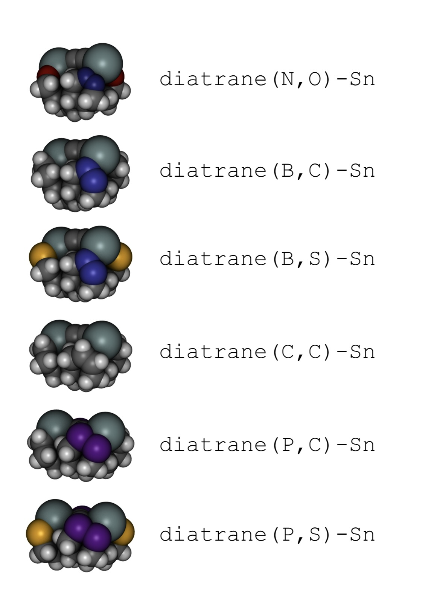
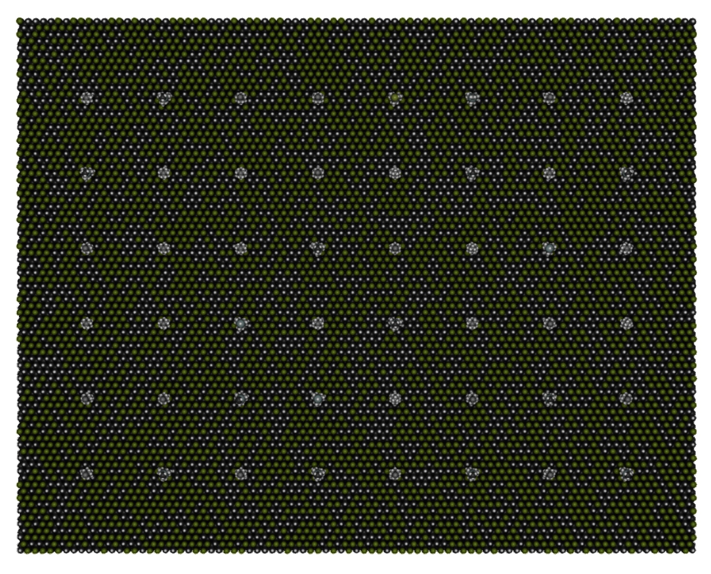
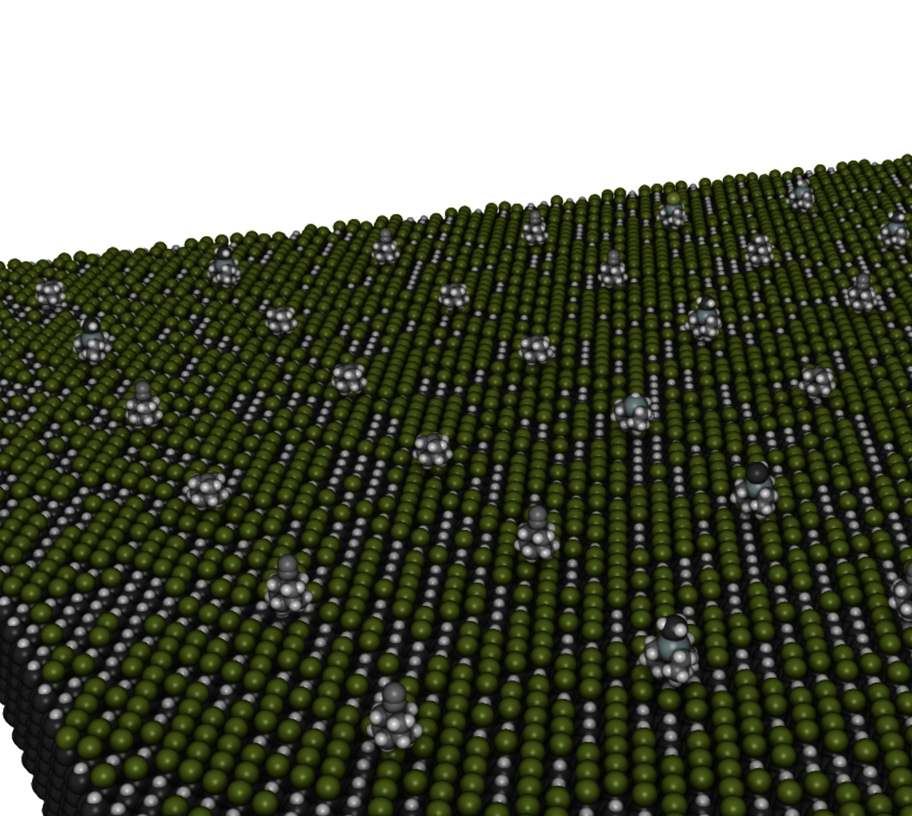

# Overview

Repo for diamondoid mechanosynthesis code and data

## Raw Data for Dimer Tooltips

|       | Isolated   |
| ----- | ---------: |
| H     | -10.71 eV  |
| H + H | -21.49 eV  |
| H2    | -26.74 eV  |
| B2    | -59.00 eV  |
| C2    | -110.09 eV |
| P2    | -136.22 eV |

|                   | Charged     | Carbenic    | Discharged  | + C2        |
| ----------------- | ----------: | ----------: | ----------: | ----------: |
| DCB6-C            | -1615.40 eV | -1615.14 eV | -1499.12 eV | -1609.34 eV |
| DCB6-CSi          | -1603.70 eV |    unstable | -1488.15 eV | -1598.28 eV |
| DCB6-Si           | -1591.33 eV | -1590.67 eV | -1476.64 eV | -1586.80 eV |
| DCB6-SiGe         | -1596.54 eV |    unstable | -1482.48 eV | -1592.62 eV |
| DCB6-Ge           | -1601.65 eV | -1600.91 eV | -1488.13 eV | -1598.26 eV |
| DCB6-GeSn         | -1605.19 eV |    unstable | -1492.30 eV | -1602.43 eV |
| DCB6-Sn           | -1608.74 eV | -1608.12 eV | -1496.48 eV | -1606.60 eV |
| DCB(H)-B          | -1418.95 eV | -1418.20 eV | -1304.00 eV | -1414.12 eV |
| DCB(F)-B          | -1648.97 eV | -1648.18 eV | -1533.98 eV | -1644.10 eV |
| DCB(N)-B          | -1607.27 eV | -1606.46 eV | -1490.64 eV | -1600.64 eV |
| DCB(P)-B          | -1584.11 eV | -1583.88 eV | -1469.09 eV | -1579.28 eV |
| DCB(As)-B         | -1575.10 eV | -1574.68 eV | -1460.08 eV | -1570.22 eV |
| DCB(H)-Al         | -1408.66 eV | -1407.64 eV | -1293.48 eV | -1403.74 eV |
| DCB(F)-Al         | -1640.02 eV | -1638.99 eV | -1524.40 eV | -1634.74 eV |
| DCB(N)-Al         | -1596.89 eV | -1595.97 eV | -1481.25 eV | -1591.68 eV | 
| DCB(P)-Al         | -1573.89 eV | -1573.00 eV | -1458.39 eV | -1568.71 eV | 
| DCB(As)-Al        | -1564.99 eV | -1563.96 eV | -1449.38 eV | -1559.66 eV |
| DCB(H)-Ga         | -1415.37 eV | -1414.51 eV | -1302.10 eV | -1412.40 eV |
| DCB(F)-Ga         | -1646.72 eV | -1645.87 eV | -1533.37 eV | -1643.69 eV |
| DCB(N)-Ga         | -1603.19 eV | -1602.31 eV | -1489.45 eV | -1599.84 eV |
| DCB(P)-Ga         | -1580.41 eV | -1579.55 eV | -1466.69 eV | -1577.00 eV |
| DCB(As)-Ga        | -1571.34 eV | -1570.44 eV | -1457.72 eV | -1568.01 eV |
| DCB(H)-N\*        | -1511.92 eV | -1511.51 eV | -1397.46 eV | -1507.58 eV |
| DCB(F)-N\*        | -1741.59 eV | -1741.15 eV | -1627.33 eV | -1737.44 eV |
| DCB(B)-N\*        | -1607.58 eV | -1607.88 eV | -1494.09 eV | -1604.24 eV |
| DCB(H)-P          | -1489.65 eV | -1489.79 eV | -1377.08 eV | -1487.19 eV |
| DCB(F)-P          | -1719.61 eV | -1719.65 eV | -1606.93 eV | -1717.06 eV |
| DCB(B)-P          | -1586.01 eV | -1585.71 eV | -1472.18 eV | -1582.27 eV |
| DCB(H)-As         | -1480.92 eV | -1480.95 eV | -1368.21 eV | -1478.30 eV |
| DCB(F)-As         | -1711.21 eV | -1711.17 eV | -1598.40 eV | -1708.40 eV |
| DCB(B)-As         | -1576.24 eV | -1575.93 eV | -1462.90 eV | -1573.00 eV |
| DC10c             | -1295.58 eV | -1293.59 eV | -1180.25 eV | -1290.40 eV |
| H4-DC10c          | -1355.35 eV | -1353.56 eV | -1238.98 eV | -1349.18 eV |
| Diatrane(B,C)-Sn  | -1664.50 eV | -1663.95 eV | -1552.35 eV | -1662.53 eV |
| Diatrane(B,O)-Sn  | -1714.45 eV | -1714.18 eV | -1602.77 eV | -1712.91 eV |
| Diatrane(B,S)-Sn  | -1671.51 eV | -1670.77 eV | -1559.29 eV | -1669.43 eV |
| Diatrane(C,C)-Sn  | -1822.97 eV | -1823.14 eV | -1711.73 eV | -1821.89 eV |
| Diatrane(C,O)-Sn  | -1873.00 eV | -1873.91 eV | -1762.30 eV | -1872.45 eV |
| Diatrane(C,S)-Sn  | -1829.99 eV | -1830.40 eV | -1718.86 eV | -1829.00 eV |
| Diatrane(Si,C)-Sn | -1778.12 eV | -1777.57 eV | -1665.58 eV | -1775.73 eV |
| Diatrane(Si,S)-Sn | -1785.52 eV | -1784.75 eV | -1672.96 eV | -1783.10 eV |
| Diatrane(P,C)-Sn  | -1811.17 eV | -1810.61 eV | -1699.27 eV | -1809.40 eV |
| Diatrane(P,S)-Sn  | -1818.36 eV | -1817.78 eV | -1706.50 eV | -1816.62 eV |

> \*Dimer is tilted at a ~10&ndash;30 degree angle.

|                   | Charged (H2) | Charged (B2) | Charged (P2) |
| ----------------- | ----------: | ----------: | ----------: |
| DCB6-C            | -1530.69 eV | -1565.65 eV | -1639.84 eV |
| DCB6-CSi          | -1518.35 eV | -1553.51 eV | -1627.57 eV | 
| DCB6-Si           | -1505.94 eV | -1541.26 eV | -1615.57 eV |
| DCB6-SiGe         | -1511.01 eV | -1546.61 eV | -1620.91 eV |
| DCB6-Ge           | -1515.98 eV | -1551.88 eV | -1626.22 eV |
| DCB6-GeSn         | -1519.58 eV | -1555.60 eV |    unstable |
| DCB6-Sn           | -1523.15 eV | -1559.34 eV | -1633.74 eV |
| DCB(N)-Ga         | -1517.56 eV | -1551.96 eV | -1627.23 eV |
| DCB(P)-Ga         |    unstable |    unstable |    unstable |
| DCB(As)-Ga        |    unstable |    unstable |    unstable |
| DCB(B)-P          | -1500.10 eV | -1536.43 eV | -1609.98 eV |
| DCB(B)-As         | -1490.17 eV | -1526.55 eV | -1600.38 eV |
| Diatrane(B,C)-Sn  | -1579.67 eV | -1614.67 eV | -1689.16 eV |
| Diatrane(B,S)-Sn  | -1586.40 eV | -1621.64 eV | -1696.17 eV |
| Diatrane(C,C)-Sn  | -1737.59 eV | -1773.04 eV | -1847.49 eV |
| Diatrane(P,C)-Sn  | -1725.82 eV | -1761.18 eV | -1835.75 eV |
| Diatrane(P,S)-Sn  | -1732.75 eV | -1768.34 eV | -1842.94 eV |

| Stability         | Discharged | H2  | B2  | C2  | P2  |
| ----------------- | ---------- | --- | --- | --- | --- |
| Diatrane(B,C)-Sn  | ✅         | ✅ | ✅ | ✅ | ❌ |
| Diatrane(B,O)-Sn  | ✅         | ✅ | ✅ | ✅ | ❌ |
| Diatrane(B,S)-Sn  | ✅         | ✅ | ✅ | ✅ | ✅ |
| Diatrane(C,C)-Sn  | ❌         | ✅ | ✅ | ✅ | ✅ |
| Diatrane(C,O)-Sn  | ❌         | ✅ | ✅ | ❌ | ❌ |
| Diatrane(C,S)-Sn  | ❌         | ✅ | ✅ | ✅ | ❌ |
| Diatrane(N,C)-Sn  | ✅         | ❌ | ✅ | ❌ | ❌ |
| Diatrane(N,O)-Sn  | ✅         | ❌ | ✅ | ❌ | ❌ |
| Diatrane(N,S)-Sn  | ✅         | ❌ | ✅ | ❌ | ❌ |
| Diatrane(Si,C)-Sn | ❌         | ✅ | ✅ | ✅ | ✅ |
| Diatrane(Si,O)-Sn | ❌         | ✅ | ✅ | ✅ | ❌ |
| Diatrane(Si,S)-Sn | ❌         | ✅ | ✅ | ✅ | ❌ |
| Diatrane(P,C)-Sn  | ✅         | ✅ | ✅ | ✅ | ✅ |
| Diatrane(P,O)-Sn  | ✅         | ✅ | ✅ | ✅ | ❌ |
| Diatrane(P,S)-Sn  | ✅         | ✅ | ✅ | ✅ | ❌ |

## Dimer Energy Tables

|                   | C2 Removal (Analytical) | C2 Removal (Numerical) | C2 Rearrangement |
| ----------------- | -------: | -------: | -------: |
| DCB6-C            | +6.19 eV | +6.06 eV | +0.26 eV |
| DCB6-CSi          | +5.46 eV | +5.42 eV |        - |
| DCB6-Si           | +4.60 eV | +4.53 eV | +0.66 eV |
| DCB6-SiGe         | +3.97 eV | +3.92 eV |        - |
| DCB6-Ge           | +3.43 eV | +3.39 eV | +0.74 eV |
| DCB6-GeSn         | +2.80 eV | +2.76 eV |        - |
| DCB6-Sn           | +2.17 eV | +2.14 eV | +0.62 eV |
| DCB(H)-B          | +4.86 eV | +4.83 eV | +0.75 eV |
| DCB(F)-B          | +4.90 eV | +4.87 eV | +0.79 eV |
| DCB(N)-B          | +6.54 eV | +6.63 eV | +0.81 eV |
| DCB(P)-B          | +4.93 eV | +4.83 eV | +0.23 eV |
| DCB(As)-B         | +4.93 eV | +4.88 eV | +0.42 eV |
| DCB(H)-Al         | +5.09 eV | +4.92 eV | +1.02 eV |
| DCB(F)-Al         | +5.53 eV | +5.28 eV | +1.03 eV |
| DCB(N)-Al         | +5.55 eV | +5.21 eV | +0.92 eV |
| DCB(P)-Al         | +5.41 eV | +5.18 eV | +0.89 eV |
| DCB(As)-Al        | +5.52 eV | +5.33 eV | +1.03 eV |
| DCB(H)-Ga         | +3.18 eV | +2.97 eV | +0.86 eV |
| DCB(F)-Ga         | +3.26 eV | +3.03 eV | +0.85 eV |
| DCB(N)-Ga         | +3.65 eV | +3.35 eV | +0.88 eV |
| DCB(P)-Ga         | +3.63 eV | +3.41 eV | +0.86 eV |
| DCB(As)-Ga        | +3.53 eV | +3.33 eV | +0.90 eV |
| DCB(H)-N          | +4.37 eV | +4.34 eV | +0.41 eV |
| DCB(F)-N          | +4.17 eV | +4.16 eV | +0.44 eV |
| DCB(B)-N          | +3.40 eV | +3.34 eV | -0.30 eV |
| DCB(H)-P          | +2.48 eV | +2.46 eV | -0.14 eV |
| DCB(F)-P          | +2.59 eV | +2.55 eV | -0.04 eV |
| DCB(B)-P          | +3.74 eV | +3.74 eV | +0.30 eV |
| DCB(H)-As         | +2.62 eV | +2.62 eV | -0.03 eV |
| DCB(F)-As         | +2.72 eV | +2.81 eV | +0.04 eV |
| DCB(B)-As         | +3.25 eV | +3.24 eV | +0.31 eV |
| DC10c             | +5.24 eV | +5.18 eV | +1.99 eV |
| H4-DC10c          | +6.28 eV | +6.17 eV | +1.79 eV |
| Diatrane(B,C)-Sn  | +2.06 eV | +1.97 eV | +0.55 eV |
| Diatrane(B,O)-Sn  | +1.59 eV | +1.54 eV | +0.27 eV |
| Diatrane(B,S)-Sn  | +2.13 eV | +2.08 eV | +0.74 eV | 
| Diatrane(C,C)-Sn  | +1.15 eV | +1.08 eV | -0.17 eV |
| Diatrane(C,O)-Sn  | +0.61 eV | +0.55 eV | -0.91 eV |
| Diatrane(C,S)-Sn  | +1.04 eV | +0.99 eV | -0.41 eV |
| Diatrane(Si,C)-Sn | +2.45 eV | +2.39 eV | +0.55 eV |
| Diatrane(Si,S)-Sn | +2.47 eV | +2.42 eV | +0.77 eV |
| Diatrane(P,C)-Sn  | +1.81 eV | +1.77 eV | +0.56 eV |
| Diatrane(P,S)-Sn  | +1.77 eV | +1.74 eV | +0.58 eV |

|                   | H2 Removal | B2 Removal | P2 Removal |
| ----------------- | -------: | -------: | -------: |
| DCB6-C            | +4.83 eV | +7.53 eV | +4.50 eV | 
| DCB6-CSi          | +3.46 eV | +6.36 eV | +3.20 eV | 
| DCB6-Si           | +2.56 eV | +5.62 eV | +2.71 eV |
| DCB6-SiGe         | +1.79 eV | +5.13 eV | +2.21 eV |
| DCB6-Ge           | +1.11 eV | +4.75 eV | +1.87 eV |
| DCB6-GeSn         | +0.54 eV | +4.30 eV |        - |
| DCB6-Sn           | -0.07 eV | +3.86 eV | +1.04 eV |
| DCB(N)-Ga         | +1.37 eV | +3.51 eV | +1.56 eV |
| DCB(P)-Ga         |        - |        - |        - |
| DCB(As)-Ga        |        - |        - |        - |
| DCB(B)-P          | +1.18 eV | +5.25 eV | +1.58 eV |
| DCB(B)-As         | +0.53 eV | +4.65 eV | +1.26 eV |
| Diatrane(B,C)-Sn  | +0.58 eV | +3.32 eV | +0.59 eV |
| Diatrane(B,S)-Sn  | +0.37 eV | +3.35 eV | +0.66 eV |
| Diatrane(C,C)-Sn  | -0.88 eV | +2.31 eV | -0.46 eV | 
| Diatrane(P,C)-Sn  | -0.19 eV | +2.91 eV | +0.26 eV |
| Diatrane(P,S)-Sn  | -0.49 eV | +2.84 eV | +0.22 eV |

### Screened Candidates

|                   | C2 Removal (Analytical) | C2 Removal (Numerical) | C2 Rearrangement |
| ----------------- | -------: | -------: | -------: |
| DCB6-Si           | +4.60 eV | +4.53 eV | +0.66 eV |
| DCB6-SiGe         | +3.97 eV | +3.92 eV |        - |
| DCB6-Ge           | +3.43 eV | +3.39 eV | +0.74 eV |
| DCB6-GeSn         | +2.80 eV | +2.76 eV |        - |
| DCB6-Sn           | +2.17 eV | +2.14 eV | +0.62 eV |
| DCB(N)-Ga         | +3.65 eV | +3.35 eV | +0.88 eV |
| DCB(P)-Ga         | +3.63 eV | +3.41 eV | +0.86 eV |
| DCB(As)-Ga        | +3.53 eV | +3.33 eV | +0.90 eV |
| DCB(B)-P          | +3.74 eV | +3.74 eV | +0.30 eV |
| DCB(B)-As         | +3.25 eV | +3.24 eV | +0.31 eV |
| Diatrane(B,C)-Sn  | +2.06 eV | +1.97 eV | +0.55 eV |
| Diatrane(B,S)-Sn  | +2.13 eV | +2.08 eV | +0.74 eV |
| Diatrane(C,C)-Sn  | +1.15 eV | +1.08 eV | -0.17 eV |
| Diatrane(P,C)-Sn  | +1.81 eV | +1.77 eV | +0.56 eV |
| Diatrane(P,S)-Sn  | +1.77 eV | +1.74 eV | +0.58 eV |

|                   | H2 Removal | B2 Removal | P2 Removal |
| ----------------- | -------: | -------: | -------: |
| DCB6-Si           | +2.56 eV | +5.62 eV | +2.71 eV |
| DCB6-SiGe         | +1.79 eV | +5.13 eV | +2.21 eV |
| DCB6-Ge           | +1.11 eV | +4.75 eV | +1.87 eV |
| DCB6-GeSn         | +0.54 eV | +4.30 eV |        - |
| DCB6-Sn           | -0.07 eV | +3.86 eV | +1.04 eV |
| DCB(N)-Ga         | +1.37 eV | +3.51 eV | +1.56 eV |
| DCB(P)-Ga         |        - |        - |        - |
| DCB(As)-Ga        |        - |        - |        - |
| DCB(B)-P          | +1.18 eV | +5.25 eV | +1.58 eV |
| DCB(B)-As         | +0.53 eV | +4.65 eV | +1.26 eV |
| Diatrane(B,C)-Sn  | +0.58 eV | +3.32 eV | +0.59 eV |
| Diatrane(B,S)-Sn  | +0.37 eV | +3.35 eV | +0.66 eV |
| Diatrane(C,C)-Sn  | -0.88 eV | +2.31 eV | -0.46 eV | 
| Diatrane(P,C)-Sn  | -0.19 eV | +2.91 eV | +0.26 eV |
| Diatrane(P,S)-Sn  | -0.49 eV | +2.84 eV | +0.22 eV |

## Successful Dimer Placements

C22 build plate, probe approaches from center of mass
- Add a second graphene sheet 0.335 nm below, to emulate the metallic surface
- Required to positionally constrain the plate, otherwise there's a false success driven by kinetic energy
- Displace Z from -0.05 to +0.16
- Displace X from -0.05 to +0.05
- Rotate around Y axis from -25° to +25°

C28 build plate, probe approaches site at positive Z
- Similar to C22 site in both structure and proximity to anchors.
- There appears to be interference from high kinetic energy simulations. Slowing it down slightly expanded the operation range before reactions became carbenic.
- This was used as the second placement site in all tested C28 sequences. All placements resulted in carbenic failure mode.
- Displace Z from +0.14 to +0.23

C28 build plate, probe approaches site at negative Z
- In one simulation, a subsequent dimer placement did not alter the state of the first dimer (at negative Z).
- In another simulation, a subsequent dimer placement caused the first dimer to become carbenic.
- Displace Z from -0.20 to -0.15 (actual bounds are likely wider)
- At Z = -0.25, there appears to be heavy interference from the nearby anchor.

## Diamondoid Build Sequence

The sequence begins with the C33 build plate. All reactions are performed with the rechargeable DCB6-Ge crossbar tool, embedded in a silicon lattice. Hydrogen abstractions are abbreviated. To positionally constrain the build plate during the difficult initiation steps, a copy was placed underneath and held fixed.

The end product is a stiff, irregular structure of carbon and hydrogen. The interior atoms are all sp3. The surface is a mixture of sp2, sp3, and carbenic carbons. 50% of the build plate's surface area has been covered in diamond.

The build sequence took 5 days to design. The molecular dynamics part takes an estimated 2 hours to replay. One or more energy minimizations was conducted after each step, adding to simulation cost.

| Object         | Orbitals | Atoms |
| -------------- | -------: | ----: |
| H              | 1        | 1     |
| H2             | 2        | 2     |
| C2             | 8        | 2     |
| C33            | 147      | 48    |
| Reactive Site  | 80       | 34    |
| Near Framework | 746      | 156   |

|                     | Orbitals (xTB) | Atoms (Inner) | Atoms (Outer) |
| ------------------- | -------------: | ------------: | ------------: |
| Simulated (Step 0)  | 227            | 82            | 252           |
| Simulated (Step 43) | 407            | 142           | 312           |
| Absolute Change     | +180           | +60           | +60           |

| Step    | Feedstock | HAbst | Tilt Angle | Timesteps | Orbitals |
| :-----: | :-------: | ----: | ---------: | --------: | -------: |
| 1(a)    | C2        | 0     | 0°         | 1080      | 155      |
| 2       | H2        | 0     | 0°         | 240       | 157      |
| 3       | C2        | 0     | 0°         | 960       | 165      |
| 4       | H2        | 0     | 0°         | 240       | 167      |
| 5       | C2        | 0     | 0°         | 960       | 175      |
| 6       | H2        | 0     | 0°         | 240       | 177      |
| 7(b)    | C2        | 0     | 0°         | 1080      | 185      |
| 8(b)    | H2        | 2     | 0°         | 240       | 187      |
| 9       | C2        | 0     | 40°        | 1080      | 193      |
| 10(b)   | C2        | 0     | 0°         | 720       | 201      |
| 11      | H2        | 0     | 30°        | 240       | 203      |
| 12      | C2        | 0     | 40°        | 720       | 211      |
| 13      | H2        | 2     | 40°        | 360       | 213      |
| 14      | C2        | 0     | 45°        | 720       | 219      |
| 15      | H2        | 1     | 45°        | 240       | 221      |
| 16      | H         | 0     | 30°        | 360       | 221      |
| 17      | H         | 2     | 0°         | 360       | 222      |
| 18      | C2        | 0     | 60°        | 720       | 228      |
| 19      | H2        | 2     | 60°        | 240       | 230      |
| 20      | -         | 1     | 45°        | 360       | 228      |
| 21      | C2        | 0     | 48°        | 720       | 235      |
| 22      | H2        | 1     | 48°        | 240       | 237      |
| 23      | C2        | 0     | 40°        | 360       | 244      |
| 24      | H2        | 1     | 40°        | 240       | 246      |
| 25      | C2        | 0     | 45°        | 360       | 253      |
| 26\*    | C2        | 0     | 45°        | 360       | 261      |
| 27      | H2        | 0     | 45°        | 360       | 263      |
| 28      | H2        | 0     | 45°        | 360       | 265      |
| 29      | -         | 2     | 30°        | 720       | 265      |
| 30      | C2        | 0     | 45°        | 360       | 271      |
| 31      | H2        | 2     | 45°        | 240       | 273      |
| 32      | C2        | 0     | 0°         | 1080      | 279      |
| 33      | H2        | 2     | 0°         | 360       | 281      |
| 34      | C2        | 0     | 0°         | 720       | 287      |
| 35\*    | H2        | 0     | 0°         | 360       | 289      |
| 36      | C2        | 0     | 0°         | 720       | 297      |
| 37(b)\* | H2        | 1     | 0°         | 360       | 299      |
| 38(b)   | C2        | 0     | 0°         | 720       | 306      |
| 39      | H2        | 0     | 0°         | 360       | 308      |
| 40      | C2        | 0     | 0°         | 360       | 316      |
| 41      | H         | 0     | 0°         | 360       | 317      |
| 42      | C2        | 0     | 0°         | 1080      | 325      |
| 43      | H2        | 0     | 0°         | 360       | 327      |

| Reaction      | Count       | % of Sequence |
| ------------- | ----------: | ------------: |
| HAbst         | 19          | 31%           |
| HDon          | 3           | 5%            |
| H2Don         | 18          | 29%           |
| C2            | 20          | 32%           |
| Rearrangement | 2           | 3%            |
| Tilted        | 21&ndash;37 | 34&ndash;60%  |
| Total         | 62          | 100%          |

> \*The code for reproducing this was not fully specified.

## Stability of Feedstock Holders

Reproduce Robert's calculations of optimality of capping agents. Test failure modes like dimerization. Then, proceed with testing the binding onto surfaces.

Characterize the molecular conformations of the legs with molecular dynamics, including the ambient vibrations of tripods currently being synthesized in experiment. Try to create molecules that have similar dynamics at up to boiling water temperature. In addition, see how the multipods respond to explicit solvation.

### Catastrophic Failure Mode of Diatrane(N,X)

<div align="center">

</div>

| Structure         | Before Minimization | After Minimization | Transition: Charged to Rearranged |
| ----------------- | ----------- | ----------- | -------- |
| Diatrane(N,O)-Sn  | -1905.60 eV | -1905.70 eV | n/a      |
| Diatrane(B,C)-Sn  | -1655.39 eV | -1664.42 eV | +0.08 eV |
| Diatrane(B,S)-Sn  | -1653.38 eV | -1671.67 eV | -0.16 eV |
| Diatrane(C,C)-Sn  | -1805.35 eV | -1825.18 eV | -2.21 eV |
| Diatrane(P,C)-Sn  | -1631.72 eV | -1812.74 eV | -1.57 eV |
| Diatrane(P,S)-Sn  | -1629.70 eV | -1820.69 eV | -2.33 eV |

Conclusion: need to add more atoms to the structure, to stiffen it up. Otherwise, this failure mode will occur in solution.

## Raw Data for Cage Tooltips

> WARNING: These energy tables are wrong. They don't allow the dissociated feedstock to change its geometric configuration.

|       | Isolated   |
| ----- | ---------: |
| H     | -10.71 eV  |
| C     | -48.85 eV  |
| C2    | -110.09 eV |
| CH2   | -80.75 eV  |
| CH3   | -96.95 eV  |
| F     | -125.70 eV |
| SiH   | -57.52 eV  |
| SiH2  | -72.65 eV  |
| SiH3  | -86.81 eV  |
| Cl    | -121.98 eV | 
| Br    | -110.16 eV |

|                           | H Removal | F Removal | Cl Removal | Br Removal |
| ------------------------- | -------- | -------- | -------- | -------- |
| ethynyl-adamantane        | +6.27 eV | +6.11 eV | +5.28 eV | +4.21 eV |
| adamantane(C) + radical   | +5.47 eV | +5.49 eV | +4.34 eV | +3.39 eV |
| adamantane(Si) + radical  | +4.72 eV | +6.30 eV | +4.71 eV | +3.89 eV |
| adamantane(Ge) + radical  | +3.94 eV | +5.22 eV | +4.13 eV | +3.40 eV |
| atrane(Si) + radical      | +4.80 eV | +6.59 eV | +4.85 eV | +4.24 eV |
| atrane(Ge) + radical      | +4.24 eV | +5.95 eV | +4.57 eV | +3.98 eV |
| atrane(Sn) + radical      | +3.50 eV | +4.45 eV | +3.49 eV | +3.11 eV |
| atrane(Pb) + radical      | +3.15 eV | +3.62 eV | +3.00 eV | +2.64 eV |

|                           | C2 Removal | CH2 Removal | CH3 Removal |
| ------------------------- | -------- | -------- | -------- |
| ethynyl-adamantane        | +4.96 eV | +7.05 eV | +6.73 eV |
| adamantane(C) + radical   | +3.80 eV | +5.47 eV | +5.81 eV |
| adamantane(Si) + radical  | +3.06 eV | +4.48 eV | +4.72 eV |
| adamantane(Ge) + radical  | +2.35 eV | +3.68 eV | +3.92 eV |
| atrane(Si) + radical      | +3.35 eV | +4.38 eV | +4.73 eV |
| atrane(Ge) + radical      | +2.81 eV | +3.82 eV | +4.18 eV |
| atrane(Sn) + radical      | +1.87 eV | +2.82 eV | +3.13 eV |
| atrane(Pb) + radical      | +1.60 eV | +2.34 eV | +2.74 eV |

|                           | Si Removal | SiH Removal | SiH2 Removal | SiH3 Removal |
| ------------------------- | -------- | -------- | -------- | -------- |
| ethynyl-adamantane        | +4.61 eV | +5.08 eV | +4.18 eV | +5.34 eV |
| adamantane(C) + radical   | +3.32 eV | +3.91 eV | +2.82 eV | +4.17 eV |
| adamantane(Si) + radical  | +2.94 eV | +3.32 eV | +2.10 eV | +3.26 eV |
| adamantane(Ge) + radical  | +2.77 eV | +3.19 eV | +1.88 eV | +3.03 eV |
| atrane(Si) + radical      | +2.67 eV | +3.04 eV | +1.99 eV | +3.18 eV |
| atrane(Ge) + radical      | +2.58 eV | +3.04 eV | +1.90 eV | +3.09 eV |
| atrane(Sn) + radical      | +2.47 eV | +2.79 eV | +1.50 eV | +2.52 eV |
| atrane(Pb) + radical      | +1.81 eV | +2.24 eV | +1.29 eV | +2.35 eV |

|                           | GaH Removal | GaCl Removal | GaH2 Removal | GaCl2 Removal |
| ------------------------- | -------- | -------- | -------- | -------- |
| ethynyl-adamantane        | +2.33 eV | +1.84 eV | +4.93 eV | +4.20 eV |
| adamantane(C) + radical   | +1.16 eV | +0.88 eV | +3.50 eV | +3.01 eV |
| adamantane(Si) + radical  | +0.86 eV | +0.75 eV | +3.01 eV | +3.12 eV |
| adamantane(Ge) + radical  | +0.61 eV | +0.44 eV | +2.48 eV | +2.54 eV |
| adamantane(As) + radical  | unstable | unstable | unstable | +0.50 eV |
| atrane(Si) + radical      | +1.49 eV | +0.74 eV | +3.11 eV | unstable |
| atrane(Ge) + radical      | +0.60 eV | +0.49 eV | +2.58 eV | unstable |
| atrane(As) + radical      | +0.61 eV | +0.37 eV | +0.46 eV | +0.76 eV |
| atrane(Sn) + radical      | +0.46 eV | +0.34 eV | +2.15 eV | +2.39 eV |
| atrane(Pb) + radical      | +0.50 eV | +0.30 eV | +1.96 eV | +2.02 eV |

|                           | Ge Removal | GeH Removal | GeH2 Removal | GeH3 Removal |
| ------------------------- | -------- | -------- | -------- | -------- |
| ethynyl-adamantane        | +5.40 eV | +5.08 eV | +2.85 eV | +5.04 eV |
| adamantane(C) + radical   | +3.87 eV | +3.77 eV | +1.58 eV | +3.79 eV |
| adamantane(Si) + radical  | +3.33 eV | +3.11 eV | +1.36 eV | +3.41 eV |
| adamantane(Ge) + radical  | +2.96 eV | +2.76 eV | +0.90 eV | +2.85 eV |
| atrane(Si) + radical      | +3.08 eV | +2.89 eV | +1.43 eV | +3.44 eV |
| atrane(Ge) + radical      | +2.80 eV | +2.63 eV | +1.11 eV | +3.06 eV |
| atrane(Sn) + radical      | +2.54 eV | +2.29 eV | +0.71 eV | +2.59 eV |
| atrane(Pb) + radical      | +2.24 eV | +2.03 eV | +0.58 eV | +2.32 eV |

|                           | As Removal | AsH Removal | AsCl Removal | AsH2 Removal | AsCl2 Removal |
| ------------------------- | -------- | -------- | -------- | -------- | -------- |
| ethynyl-adamantane        | +5.13 eV | +4.79 eV | +4.71 eV | +4.69 eV | +4.56 eV |
| adamantane(C) + radical   | +3.57 eV | +3.52 eV | +3.45 eV | +3.55 eV | +3.42 eV |
| adamantane(Si) + radical  | +3.43 eV | +3.22 eV | +3.07 eV | +3.19 eV | +3.03 eV |
| adamantane(Ga) + radical  | unstable | unstable | unstable | +1.27 eV | unstable |
| adamantane(Ge) + radical  | +3.03 eV | +2.79 eV | +2.63 eV | +2.70 eV | +2.54 eV |
| atrane(Si) + radical      | +3.25 eV | +3.10 eV | +3.03 eV | +3.13 eV | +3.17 eV |
| atrane(Ga) + radical      | unstable | unstable | unstable | +0.78 eV | unstable |
| atrane(Ge) + radical      | +2.98 eV | +2.81 eV | +2.73 eV | +2.78 eV | +2.80 eV |
| atrane(Sn) + radical      | +2.66 eV | +2.37 eV | +2.23 eV | +2.26 eV | +2.19 eV |
| atrane(Pb) + radical      | +2.22 eV | +2.02 eV | +1.90 eV | +1.98 eV | +1.83 eV |

## Misreactions During HAbst on Silicon

When the hydrogen is not pointing directly up, but on the side. Furthermore, the exact orientation of the hydrogen(s) are unknown. There are two problems. The acetylene group will electrostatically attract the Si atom, often bonding with it. Second, the reaction may need to be repeated multiple times, as some sites will not contain a hydrogen.

Design a protocol for automating hydrogen abstraction with effectively zero error rate.

### Varying One Spatial Coordinate

Finding the greatest Y separation where an event occurred. Fr = Frames.

|     Z     | 360 Fr, 0.3 nm | 720 Fr, 0.3 nm | 1080 Fr, 0.45 nm |
| --------: | -------------: | -------------: | ---------------: |
| -0.40 nm  |    no reaction |    no reaction |     no reaction |
| -0.375 nm |                |                |     no reaction |
| -0.35 nm  |        0.65 nm |        0.65 nm |        0.700 nm |
| -0.30 nm  |        0.70 nm |        0.70 nm |        0.750 nm |
| -0.25 nm  |        0.75 nm |        0.75 nm |        0.775 nm |
| -0.20 nm  |        0.75 nm |        0.75 nm |        0.775 nm |
| -0.175 nm |                |                | (fail) 0.800 nm |
| -0.15 nm  | (fail) 0.80 nm | (fail) 0.80 nm | (fail) 0.800 nm |
| -0.10 nm  | (fail) 0.80 nm |                |                 |
| -0.05 nm  |                |                |                 |
|  0.00 nm  |                |                |                 |
| +0.05 nm  |                |                |                 |
| +0.10 nm  | (fail) 0.80 nm |                |                 |
| +0.15 nm  | (fail) 0.80 nm |                |                 |
| +0.20 nm  | (fail) 0.75 nm |                |                 |
| +0.25 nm  | (fail) 0.70 nm | (fail) 0.70 nm | (fail) 0.750 nm | 
| +0.275 nm |                |                | (fail) 0.700 nm |
| +0.30 nm  |    no reaction |    no reaction |     no reaction |

|     X     | 360 Fr, 0.3 nm | 720 Fr, 0.3 nm | 1080 Fr, 0.45 nm |
| --------: | -------------: | -------------: | ---------------: |
|  0.00 nm  |                |                |                 |
| +0.05 nm  | (fail) 0.80 nm |                |                 |
| +0.10 nm  | (fail) 0.80 nm |                |                 |
| +0.15 nm  | (fail) 0.80 nm | (fail) 0.80 nm | (fail) 0.800 nm |
| +0.20 nm  | (fail) 0.75 nm | (fail) 0.75 nm | (fail) 0.775 nm |
| +0.225 nm |                |                |        0.750 nm |
| +0.25 nm  |        0.75 nm |        0.75 nm |        0.750 nm |
| +0.30 nm  |        0.70 nm |        0.70 nm |        0.725 nm |
| +0.325 nm |                |                |        0.700 nm |
| +0.35 nm  | (fail) 0.60 nm | (fail) 0.60 nm | (fail) 0.625 nm |

For x = +0.35 nm, the failure comes from abstracting the wrong hydrogen. The tooltip touches one of the surface silicons with a hydrogen pointing straight up.

### First Hydrogen

For a SiH3 deposited onto the bare crystalline surface, the following operating range should minimize the chance of a misreaction. Radius varies 0.300 and 0.400, elevation varies between 0.675 and 0.775. The tooltip offset is uniformly distributed in a torus matching these parameters. The chance of an abstraction happening would be on the order of 10%, so numerous encounters would be required IRL.

When a spent tooltip approaches the radical site, it doesn't react. When a charged tooltip approaches, it does react.

### Rough Exploration of Operating Range

Each measurement is at 360 frames, 0.3 nm. The labels correspond to the following tooltips:
- <b>Acetylene (Adamantane-Carbon).</b> The acetylene tooltip is charged before the approach. Electronic temperature raised to 1500 K.
- <b>Borane (Adamantane-Carbon).</b> The sp2 hybridization plane of the BH2 group is intersected by the displacement vector.
- <b>Borane (Atrane-Tin).</b> The sp2 hybridization plane of the BH2 group is intersected by the displacement vector.

|    Z     |   Acetylene    | Borane (Carbon) |
| -------: | -------------: | -------------: |
| -0.45 nm |    no reaction |                |
| -0.40 nm | (fail) 0.65 nm |    no reaction |
| -0.35 nm | (fail) 0.70 nm | (fail) 0.45 nm |
| -0.30 nm | (fail) 0.75 nm | (fail) 0.45 nm |
| -0.25 nm | (fail) 0.80 nm | (fail) 0.50 nm |
| -0.20 nm | (fail) 0.80 nm | (fail) 0.50 nm |
| -0.15 nm | (fail) 0.80 nm | (fail) 0.50 nm |
| -0.10 nm | (fail) 0.80 nm | (fail) 0.45 nm |
| -0.05 nm | (fail) 0.85 nm | (fail) 0.45 nm |
|  0.00 nm | (fail) 0.85 nm | (fail) 0.50 nm |
| +0.05 nm | (fail) 0.85 nm |                |
| +0.10 nm | (fail) 0.80 nm |                |
| +0.15 nm | (fail) 0.80 nm |                |
| +0.20 nm | (fail) 0.80 nm |                |
| +0.25 nm | (fail) 0.80 nm |                |
| +0.30 nm | (fail) 0.75 nm |                |
| +0.35 nm | (fail) 0.70 nm |                |
| +0.40 nm | (fail) 0.60 nm |                |
| +0.45 nm |    no reaction |                |

|    X     |   Acetylene    | Borane (Carbon) | Borane (Tin)  |
| -------: | -------------: | -------------: | -------------: |
| +0.05 nm | (fail) 0.80 nm | (fail) 0.55 nm | (fail) 0.70 nm |
| +0.10 nm |        0.85 nm | (fail) 0.45 nm | (fail) 0.70 nm |
| +0.15 nm |        0.85 nm | (fail) 0.50 nm | (fail) 0.70 nm |
| +0.20 nm |        0.85 nm | (fail) 0.50 nm | (fail) 0.70 nm |
| +0.25 nm |        0.80 nm |    no reaction |    no reaction |
| +0.30 nm |        0.80 nm |                |                |
| +0.35 nm |        0.75 nm |                |                |
| +0.40 nm | (fail) 0.60 nm |                |                |

For x = +0.40 nm, the failure comes from abstracting the wrong hydrogen.

### Borane (Atrane-Tin)

This abstraction may depend heavily on the rotational state of the tooltip. One of the sidewall carbons appears to push the Si into a different location.

|     X     | 540 Fr, 0.45 nm | 720 Fr, 0.6 nm | 1440 Fr, 0.6 nm |
| --------: | -------------: | -------------: | ---------------: |
| +0.05 nm  |                |                |                 |
| +0.10 nm  |                |                |                 |
| +0.15 nm  |                |                |                 |
| +0.20 nm  | (fail) 0.70 nm | (fail) 0.70 nm | (fail) 0.700 nm |
| +0.25 nm  |        0.45 nm |        0.40 nm |     no reaction |
| +0.30 nm  |        0.40 nm |        0.40 nm |        0.425 nm |
| +0.35 nm  |        0.45 nm |        0.45 nm | (fail) 0.425 nm |
| +0.40 nm  | (fail) 0.50 nm | (fail) 0.50 nm | (fail) 0.525 nm |

### Varying the Binding Atom

The tooltip with tin worked sort of well, but the tip with carbon never worked. Perhaps the atom bonded to the borane has an effect. Germanium could bond more strongly and minimize the chance of dissociation.

Each measurement is at 540 frames, 0.45 nm. The setup is identical to the previous section. Electronic temperature is kept at 300 K.

|     X     | Adamantane(C)  | Adamantane(Ge) | Atrane(Ge)     |
| --------: | -------------: | -------------: | -------------: |
| +0.05 nm  |                |                |                |
| +0.10 nm  |                |                |                |
| +0.15 nm  |                |                |                |
| +0.20 nm  | (fail) 0.50 nm | (fail) 0.60 nm | (fail) 0.60 nm |
| +0.25 nm  |    no reaction |    no reaction |    no reaction |
| +0.30 nm  |    no reaction |    no reaction |    no reaction |
| +0.35 nm  |    no reaction |                |                |

### Adamantyl Tooltip

It looks like the BH2 tooltip is not viable, or simulations where it works are computationally intractable. Next, I will explore the carbon radical and the effect of tilting the tooltip.

Each measurement is at 360 frames, 0.3 nm.
- <b>Radical.</b> The carbon adamantane tooltip with no feedstock.
- <b>Radical (22.5°).</b> The carbon radical tooltip, tilted slightly toward -Z or +X. The axis of rotation is horizontal and perpendicular to the offset vector.

|    Z     |     Radical    | Radical (22.5°) |
| -------: | -------------: | -------------: |
| -0.45 nm |                |    no reaction |
| -0.40 nm |                | (fail) 0.40 nm |
| -0.35 nm |    no reaction | (fail) 0.45 nm |
| -0.30 nm | (fail) 0.50 nm | (fail) 0.50 nm |
| -0.25 nm | (fail) 0.50 nm | (fail) 0.55 nm |
| -0.20 nm | (fail) 0.55 nm | (fail) 0.55 nm |
| -0.15 nm | (fail) 0.55 nm | (fail) 0.55 nm |
| -0.10 nm | (fail) 0.60 nm | (fail) 0.60 nm |
| -0.05 nm | (fail) 0.60 nm | (fail) 0.55 nm |
|  0.00 nm | (fail) 0.55 nm | (fail) 0.55 nm |
| +0.05 nm | (fail) 0.55 nm | (fail) 0.55 nm |
| +0.10 nm | (fail) 0.55 nm | (fail) 0.50 nm |
| +0.15 nm | (fail) 0.55 nm | (fail) 0.50 nm |
| +0.20 nm | (fail) 0.50 nm | (fail) 0.45 nm |
| +0.25 nm | (fail) 0.45 nm |    no reaction |
| +0.30 nm |    no reaction |                |

|    X     |     Radical    | Radical (22.5°) |
| -------: | -------------: | -------------: |
| -0.35 nm |    no reaction |                |
| -0.30 nm |        0.45 nm |                |
| -0.25 nm |        0.55 nm |    no reaction |
| -0.20 nm |        0.55 nm |        0.50 nm |
| -0.15 nm |        0.60 nm |        0.55 nm |
| -0.10 nm |        0.60 nm |        0.60 nm |
| -0.05 nm |        0.60 nm |        0.60 nm |
|  0.00 nm | (fail) 0.55 nm |        0.60 nm |
| +0.05 nm |        0.60 nm | (fail) 0.55 nm |
| +0.10 nm |        0.60 nm |        0.60 nm |
| +0.15 nm |        0.60 nm |        0.60 nm |
| +0.20 nm |        0.55 nm |        0.60 nm |
| +0.25 nm |        0.55 nm |        0.55 nm |
| +0.30 nm |        0.50 nm |        0.50 nm |
| +0.35 nm |    no reaction |        0.45 nm |
| +0.40 nm |                |    no reaction |

It looks like tilting the tooltip doesn't help. The Y operating range of this tooltip is no better than with acetylene. However, the X/Z operating range looks smaller. This makes sense, as the tool is less flexible. The tooltip would be more viable in crowded situations. It could select specific hydrogens to be abstracted, with a smaller chance of abstracting the wrong ones.

## Ethylation

I want to form 5-membered rings on the Si(111) surface reliably. There is a concerning misreaction where the Si-H bond breaks, forming a SiH3 and SiH: group. Analyze the energies of all relevant workpiece states.

## Video Plans

I finally got the hang of Si mechanosynthesis. There was a large build sequence that made a crystalline lattice. I want to make a video of it.

<div align="center">

</div>

<div align="center">

</div>

Title: "Build sequence for crystalline silicon, with one 3DoF AFM probe"

Short video:
- Soundtrack: second half of "Force"

Build sequence:
- Title: "Build Sequence"
- Subtitle: "four adamantasilane cages \n pyramid with a Ge dopant"
- Animate the probe traversing the surface, with the following captions:
  - Reaction name
  - Reaction type
  - Tooltip name
- Objects:
  - Silicon surface
  - Active reaction
  - Charged/spent tripods from other reactions
- Program the camera to:
  - Follow the AFM probe
  - Rotate at a few specific times
  - Animate the transition between scenes (no fancy easing in/out)

Summary of build sequence:
- Title: "Summary"
- Replay the energy minimizations in sequence, with the following captions:
  - Reaction name
  - Reaction type
- Objects:
  - Surface of reaction
  - Camera rotates around the product during the last 5 seconds
  
I found an algorithm for animating a fade-in transition. I don't know where to archive it, so I'm copying the code here.

```swift
var appearingFrameIDs: [Int16] = []
for _ in sceneAtoms.indices {
  var randomNumber = Float.random(in: 0..<1)
  randomNumber *= 600
  
  var randomFrame = Int16(randomNumber)
  randomFrame = max(0, min(599, randomFrame))
  appearingFrameIDs.append(randomFrame)
}

for frameID in 0..<600 {
  var frame: [Entity] = []
  for atomID in sceneAtoms.indices {
    let atom = sceneAtoms[atomID]
    let appearingFrameID = appearingFrameIDs[atomID]
    guard frameID >= appearingFrameID else {
      continue
    }
    frame.append(atom)
  }
  frames.append(frame)
}
```

## Primitives

I am working on a silicon mechanosynthesis primitive, named "Primitive 2". It involves completing an adamantane cage at a double-bridgehead site. There is a sterically crowded hydrogen abstraction, which is required to avoid use of carbenes. I am going to profile its operating range.

Tooltip: Adamantyl

Surface: Si(111)

### Tripod Oriented Straight Up

|  X   |  Y   |  Z   | 240 Fr, 0.20 nm | 540 Fr, 0.30 nm | 1440 Fr, 0.40 nm |
| ---: | ---: | ---: | --------------: | --------------: | --------------: |
|  0.00 nm | +0.40 nm | -0.15 nm | success     | success     | success     |
|  0.00 nm | +0.40 nm | -0.18 nm | no reaction |             |             |
|  0.00 nm | +0.40 nm | -0.17 nm | success     | success     |             |
|  0.00 nm | +0.40 nm | -0.16 nm | success     |             |             |
|  0.00 nm | +0.40 nm | -0.14 nm | success     |             |             |
|  0.00 nm | +0.40 nm | -0.13 nm | success     |             |             |
|  0.00 nm | +0.40 nm | -0.12 nm | success     | success     |             |
|  0.00 nm | +0.40 nm | -0.11 nm | bonds to Si |             |             |
|  0.00 nm | +0.37 nm | -0.15 nm | success     | success     |             |
|  0.00 nm | +0.38 nm | -0.15 nm | success     |             |             |
|  0.00 nm | +0.39 nm | -0.15 nm | success     |             |             |
|  0.00 nm | +0.41 nm | -0.15 nm | success     |             |             |
|  0.00 nm | +0.42 nm | -0.15 nm | success     |             |             |
|  0.00 nm | +0.43 nm | -0.15 nm | success     |             |             |
|  0.00 nm | +0.44 nm | -0.15 nm | success     |             |             |
|  0.00 nm | +0.45 nm | -0.15 nm | success     | success     | success     |
|  0.00 nm | +0.46 nm | -0.15 nm | success     | no reaction |             |
|  0.00 nm | +0.47 nm | -0.15 nm | success     | no reaction |             |
|  0.00 nm | +0.48 nm | -0.15 nm | no reaction | no reaction |             |
| -0.05 nm | +0.40 nm | -0.15 nm | no reaction |             |             |
| -0.04 nm | +0.40 nm | -0.15 nm | success     | success     | success     |
| -0.03 nm | +0.40 nm | -0.15 nm | success     |             |             |
| +0.01 nm | +0.40 nm | -0.15 nm | success     |             |             |
| +0.02 nm | +0.40 nm | -0.15 nm | success     |             |             |
| +0.03 nm | +0.40 nm | -0.15 nm | success     |             |             |
| +0.05 nm | +0.40 nm | -0.15 nm | success     |             |             |
| +0.08 nm | +0.40 nm | -0.15 nm | success     | success     |             |
| +0.10 nm | +0.40 nm | -0.15 nm | success     |             |             |
| +0.12 nm | +0.40 nm | -0.15 nm | no reaction | success     |             |

The adamantyl tooltip deforms the adjacent wall quite a bit. Until it's tested with proper constraints on the edge atoms, only use when the wall thickness equals half an adamantane cage.

Granted the remaining degrees of freedom all pass, it is acceptable to use this primitive in a build sequence. With no restrictions. But the build sequence must be tested at a higher level of theory (ONIOM), which simulates bulk stiffness and compliance.

### Tripod Positioned at (0.00, 0.40, -0.15)

|  X   |  Y   |  Z   | 240 Fr, 0.20 nm | 540 Fr, 0.30 nm | 1440 Fr, 0.40 nm |
| ---: | ---: | ---: | --------------: | --------------: | --------------: |
|    0° |    0° |    0° | success     | success     | success     |
|    0° |  +10° |    0° | success     |             |             |
|    0° |  +20° |    0° | success     |             |             |
|    0° |  +30° |    0° | success     | success     |             |
|    0° |  +40° |    0° | success     |             |             |
|    0° |  +50° |    0° | success     |             |             |
|    0° |  +60° |    0° | success     | success     |             |
|    0° |  +90° |    0° | success     | success     | success     |
|  -20° |    0° |    0° | bonds to Si |             |             |
|  -15° |    0° |    0° | bonds to Si |             |             |
|  -12° |    0° |    0° | success     | success     |             |
|  -10° |    0° |    0° | success     | success     |             |
|   -7° |    0° |    0° | success     |             |             |
|   -5° |    0° |    0° | success     |             |             |
|   +5° |    0° |    0° | success     | success     |             |
|   +7° |    0° |    0° | no reaction | success     |             |
|  +10° |    0° |    0° | no reaction | no reaction |             |
|    0° |    0° |  -10° | success     | success     |             |
|    0° |    0° |   -5° | success     |             |             |
|    0° |    0° |   +5° | success     |             |             |
|    0° |    0° |  +10° | success     |             |             |
|    0° |    0° |  +15° | success     | success     |             |
|    0° |    0° |  +20° | success     |             |             |
|    0° |    0° |  +25° | solver fail | H pops off  |             |

### Bond Scission

It is impossible to eliminate silicon diradicals from build sequences. Therefore, I must find a way to maximize the success rate of reactions involving silene. To start, I will roll back to the beginning of the Si(111) build sequence. This is to reduce the compute cost, allowing a larger search space to be explored. Then, I will return to "Primitive 2" and verify that the protocol works for the problematic reaction.

Main question:
- Must the silene group's orientation be constrained on the tripod?
- With the potentially dative structure of germene's orientational constraint, can it still be deposited like silene? If not, that is concerning, as the result would be highly sensitive to modeling error.

I don't need a "protocol", now that carbenes can be positionally constrained, and germenes are shown to work. It is just trial and error. Certain trajectories will break xTB. Try a different trajectory or orientation until one of them works. Only allow the tooltip to rotate in multiples of 120°.

## Rechargeable Hydrogen Abstraction Tool

I am trying to create a rechargeable tool for transforming SiH3 into SiH: feedstocks. One interesting idea was to use a silicon radical, within an admantane cage. The silicon's partial charge differs from that in bulk. R&R previously exploited the differences between Ge bonded to C and Ge bonded to Ge (MinToolset paper).

Hydrogen atom energy: -10.71 eV

| Binding Site | Framework | Energy\* | Si (radical) | Si (Si-H) | H (Si-H) |
| ---------------------- | -------------- | -------: | ----: | ----: | -----: |
| bridgehead Si radical | silicon        | -4.06 eV | 0.130 | 0.185 | -0.173 |
| bridgehead Si radical | adamantane     | -4.71 eV | 0.413 | 0.497 | -0.084 |
| bridgehead Si radical | atrane         | -4.77 eV | 0.377 | 0.482 | -0.111 |
| primary Si radical    | silicon        | -4.51 eV | 0.253 | 0.351 | -0.143 |
| primary Si radical    | adamantane(Ge) | -4.60 eV | 0.336 | 0.426 | -0.078 |
| primary Si radical    | atrane(Sn)     | -4.37 eV | 0.348 | 0.407 | -0.078 |
| primary Si diradical  | silicon        | -3.19 eV | 0.265 | 0.253 | -0.106 |
| primary Si diradical  | adamantane(Ge) | -3.06 eV | 0.381 | 0.336 | -0.065 |
| primary Si diradical  | atrane(Sn)     | -3.14 eV | 0.401 | 0.348 | -0.068 |

> \*Hydrogen binding energy.
>
> The last three columns are the partial charges for each atom.

Reaction 1
- bridgehead Si radical on silicon, hydrogen pointing vertical
- bridgehead Si radical on adamantane
- X = -0.19, but can tolerate up to 0.10 nm positioning error
- Y = 0.69 or lower, may damage workpiece at ~0.60 nm
- Z = 0.12, but can tolerate up to 0.10 nm positioning error

Reaction 2
- bridgehead Si radical on silicon, hydrogen pointing sideways
- bridgehead Si radical on adamantane
- X = 0.00 while gathering data for tables

### Tripod Not Rotated

|  Y \ Z   | -0.20 nm | -0.18 nm | -0.16 nm | -0.14 nm | -0.12 nm |
| -------: | -------: | -------: | -------: | -------: | -------: |
| +0.56 nm |          |          |          |          | fail     |
| +0.54 nm |          |          |          |          | damage   |
| +0.52 nm |          |          | fail     | fail     | damage   |
| +0.50 nm | fail     |          | success  | success  | damage   |
| +0.48 nm | fail     | fail     | success  | success  | damage   |
| +0.46 nm | fail     | success  | success  | success  | damage   |
| +0.44 nm | fail     | success  | success  | success  | damage   |
| +0.42 nm | fail     | success  | success  | damage   |          |
| +0.40 nm | fail     | success  | success  | damage   |          |
| +0.38 nm | fail     | success  | success  |          |          |

### Tripod Rotated 60° Around Y-Axis

|  Y \ Z   | -0.20 nm | -0.18 nm | -0.16 nm | -0.14 nm | -0.12 nm |
| -------: | -------: | -------: | -------: | -------: | -------: |
| +0.56 nm |          |          |          |          |          |
| +0.54 nm |          |          |          | fail     |          |
| +0.52 nm |          |          |          | damage   |          |
| +0.50 nm |          |          | fail     | damage   |          |
| +0.48 nm |          | fail     | success  | damage   |          |
| +0.46 nm | fail     | success  | success  |          |          |
| +0.44 nm | fail     | success  | success  |          |          |
| +0.42 nm | fail     | success  | success  |          |          |
| +0.40 nm | fail     |          | success  |          |          |
| +0.38 nm |          |          | success  |          |          |

## New Energy Tables

| HHHHHH              | H (CH3)  | H (SiH3) | H (SiH2) | H (GeH3) | H (GeH2) |
| ------------------- | -------: | -------: | -------: | -------: | -------: |
| ethynyl-adamantane  | +5.02 eV | +4.78 eV | +3.34 eV | +4.31 eV | +1.97 eV |
| adamantane(C)       | +5.66 eV | +4.85 eV | +3.22 eV | +4.18 eV | +2.23 eV |
| adamantane(Si)      | +5.47 eV | +4.58 eV | +3.18 eV | +4.14 eV | +2.60 eV |
| adamantane(Ge)      | +5.48 eV | +4.60 eV | +3.07 eV | +3.99 eV | +2.50 eV |
| atrane(Si)          | +5.53 eV | +4.52 eV | +3.40 eV | +4.07 eV | +2.92 eV |
| atrane(Ge)          | +5.58 eV | +4.56 eV | +3.26 eV | +3.96 eV | +2.84 eV |
| atrane(Sn)          | +5.56 eV | +4.37 eV | +3.14 eV | +3.81 eV | +2.82 eV |
| atrane(Pb)          | +5.69 eV | +4.38 eV | +3.48 eV | +3.67 eV | +2.97 eV |
| adamantasilane(C)   | +4.96 eV | +4.75 eV | +3.03 eV | +4.07 eV | +2.10 eV |
| adamantasilane(Si)  | +5.07 eV | +4.47 eV | +3.11 eV | +3.88 eV | +2.66 eV |
| adamantasilane(Ge)  | +5.25 eV | +4.56 eV | +3.01 eV | +3.85 eV | +2.62 eV |
| adamantasilane(Sn)  | +5.35 eV | +4.40 eV | +2.94 eV | +3.84 eV | +2.56 eV |
| adamantasilane(Pb)  | +5.62 eV | +4.50 eV | +3.53 eV | +3.88 eV | +2.83 eV |

| HHHHHH              | Br (CBr3) | Br (SiBr3) | Br (SiBr2) |
| ------------------- | -------: | -------: | -------: |
| ethynyl-adamantane  | +1.92 eV | +1.88 eV | +3.44 eV |
| adamantane(C)       | +1.98 eV | +1.94 eV | +3.44 eV |
| adamantane(Si)      | +2.39 eV | +2.18 eV | +3.22 eV |
| adamantane(Ge)      | +2.37 eV | +2.06 eV | +3.09 eV |
| atrane(Si)          | +2.64 eV | +2.61 eV | +3.22 eV |
| atrane(Ge)          | +2.61 eV | +2.48 eV | +3.10 eV |
| atrane(Sn)          | +2.68 eV | +2.43 eV | +3.02 eV |
| atrane(Pb)          | +2.49 eV | +2.59 eV | +2.88 eV |
| adamantasilane(C)   | +2.25 eV | +1.84 eV | +3.44 eV |
| adamantasilane(Si)  | +2.13 eV | +2.12 eV | +3.10 eV |
| adamantasilane(Ge)  | +2.28 eV | +2.11 eV | +3.12 eV |
| adamantasilane(Sn)  | +2.73 eV | +2.15 eV | +3.24 eV |
| adamantasilane(Pb)  | +2.56 eV | +2.57 eV | +3.17 eV |

| HHHHHH              | H        | F        | Cl       | Br       |
| ------------------- | -------: | -------: | -------: | -------: |
| ethynyl-adamantane  | +6.26 eV | +6.09 eV | +5.26 eV | +4.20 eV |
| adamantane(C)       | +5.29 eV | +5.36 eV | +4.23 eV | +3.27 eV |
| adamantane(Si)      | +4.71 eV | +6.29 eV | +4.70 eV | +3.87 eV |
| adamantane(Ge)      | +3.86 eV | +5.10 eV | +4.07 eV | +3.30 eV |
| atrane(Si)          | +4.78 eV | +6.56 eV | +4.82 eV | +4.18 eV |
| atrane(Ge)          | +4.11 eV | +5.69 eV | +4.43 eV | +3.79 eV |
| atrane(Sn)          | +3.29 eV | +4.21 eV | +3.33 eV | +2.92 eV |
| atrane(Pb)          | +2.92 eV | +3.36 eV | +2.79 eV | +2.46 eV |
| adamantasilane(C)   | +4.61 eV | +4.39 eV | +3.43 eV | +2.52 eV |
| adamantasilane(Si)  | +3.99 eV | +5.76 eV | +4.13 eV | +3.19 eV |
| adamantasilane(Ge)  | +3.77 eV | +5.43 eV | +4.23 eV | +3.35 eV |
| adamantasilane(Sn)  | +3.30 eV | +4.33 eV | +3.47 eV | +2.94 eV |
| adamantasilane(Pb)  | +3.44 eV | +3.75 eV | +3.27 eV | +2.83 eV |

| HHHHFF              | H        | F        | Cl       | Br       |
| ------------------- | -------: | -------: | -------: | -------: |
| ethynyl-adamantane  | +6.32 eV | +6.14 eV | +5.30 eV | +4.23 eV |
| adamantane(C)       | +5.33 eV | +5.14 eV | +4.05 eV | +3.07 eV |
| adamantane(Si)      | +4.72 eV | +6.16 eV | +4.59 eV | +3.70 eV |
| adamantane(Ge)      | +3.75 eV | +4.84 eV | +3.90 eV | +3.09 eV |
| atrane(Si)          | +4.81 eV | +6.41 eV | +4.64 eV | +3.93 eV |
| atrane(Ge)          | +4.01 eV | +5.42 eV | +4.21 eV | +3.52 eV |
| atrane(Sn)          | +3.12 eV | +3.97 eV | +3.12 eV | +2.67 eV |
| atrane(Pb)          | +2.74 eV | +3.05 eV | +2.48 eV | +2.15 eV |
| adamantasilane(C)   | +4.66 eV | +4.31 eV | +3.35 eV | +2.39 eV |
| adamantasilane(Si)  | +3.94 eV | +5.68 eV | +4.04 eV | +3.05 eV |
| adamantasilane(Ge)  | +3.62 eV | +5.22 eV | +4.05 eV | +3.12 eV |
| adamantasilane(Sn)  | +3.09 eV | +4.12 eV | +3.28 eV | +2.70 eV |
| adamantasilane(Pb)  | +3.25 eV | +3.54 eV | +3.05 eV | +2.60 eV |

| FFFFFF              | H        | F        | Cl       | Br       |
| ------------------- | -------: | -------: | -------: | -------: |
| ethynyl-adamantane  | +6.42 eV | +6.20 eV | +5.38 eV | +4.29 eV |
| adamantane(C)       | +5.40 eV | +4.75 eV | +3.79 eV | +2.77 eV |
| adamantane(Si)      | +4.68 eV | +5.84 eV | +4.43 eV | +3.45 eV |
| adamantane(Ge)      | +3.40 eV | +4.25 eV | +3.51 eV | +2.64 eV |
| atrane(Si)          | +4.86 eV | +6.14 eV | +4.41 eV | +3.59 eV |
| atrane(Ge)          | +3.77 eV | +4.85 eV | +3.81 eV | +3.03 eV |
| atrane(Sn)          | +2.80 eV | +3.57 eV | +2.82 eV | +2.31 eV |
| atrane(Pb)          | +2.42 eV | +2.53 eV | +2.00 eV | +1.67 eV |
| adamantasilane(C)   | +4.79 eV | +4.19 eV | +3.25 eV | +2.21 eV |
| adamantasilane(Si)  | +3.82 eV | +5.47 eV | +3.90 eV | +2.78 eV |
| adamantasilane(Ge)  | +3.26 eV | +4.70 eV | +3.68 eV | +2.64 eV |
| adamantasilane(Sn)  | +2.60 eV | +3.77 eV | +2.95 eV | +2.28 eV |
| adamantasilane(Pb)  | +2.78 eV | +3.13 eV | +2.62 eV | +2.16 eV |

| HHHHHH              | C2       | CH2      | CH3      |
| ------------------- | -------: | -------: | -------: |
| ethynyl-adamantane  | +4.72 eV | +6.91 eV | +6.44 eV |
| adamantane(C)       | +3.58 eV | +5.11 eV | +5.27 eV |
| adamantane(Si)      | +2.96 eV | +4.40 eV | +4.38 eV |
| adamantane(Ge)      | +2.18 eV | +3.60 eV | +3.59 eV |
| atrane(Si)          | +3.22 eV | +4.33 eV | +4.36 eV |
| atrane(Ge)          | +2.57 eV | +3.69 eV | +3.77 eV |
| atrane(Sn)          | +1.66 eV | +2.61 eV | +2.67 eV |
| atrane(Pb)          | +1.46 eV | +2.10 eV | +2.29 eV |
| adamantasilane(C)   | +3.07 eV | +4.87 eV | +4.33 eV |
| adamantasilane(Si)  | +2.55 eV | +4.01 eV | +3.59 eV |
| adamantasilane(Ge)  | +2.37 eV | +3.67 eV | +3.42 eV |
| adamantasilane(Sn)  | +1.76 eV | +2.83 eV | +2.69 eV |
| adamantasilane(Pb)  | +1.77 eV | +2.54 eV | +2.66 eV |

| HHHHHH              | CBr2     | CBr3     | SiBr2    | SiBr3    |
| ------------------- | -------: | -------: | -------: | -------: |
| ethynyl-adamantane  | +5.24 eV | +5.29 eV | +3.11 eV | +4.98 eV |
| adamantane(C)       | +3.80 eV | +3.91 eV | +1.82 eV | +3.69 eV |
| adamantane(Si)      | +3.02 eV | +3.54 eV | +1.55 eV | +3.20 eV |
| adamantane(Ge)      | +2.11 eV | +2.61 eV | +1.27 eV | +2.80 eV |
| atrane(Si)          | +3.23 eV | +3.99 eV | +1.83 eV | +3.49 eV |
| atrane(Ge)          | +2.56 eV | +3.29 eV | +1.65 eV | +3.19 eV |
| atrane(Sn)          | +1.80 eV | +2.61 eV | +1.34 eV | +2.80 eV |
| atrane(Pb)          | +1.23 eV | +1.85 eV | +0.90 eV | +2.21 eV |
| adamantasilane(C)   | +3.34 eV | +3.72 eV | +1.31 eV | +3.18 eV |
| adamantasilane(Si)  | +2.51 eV | +2.76 eV | +0.99 eV | +2.52 eV |
| adamantasilane(Ge)  | +2.35 eV | +2.76 eV | +1.22 eV | +2.78 eV |
| adamantasilane(Sn)  | +1.92 eV | +2.78 eV | +1.13 eV | +2.81 eV |
| adamantasilane(Pb)  | +1.62 eV | +2.30 eV | +1.05 eV | +2.64 eV |

| HHHHHH              | SiH:     | SiH2     | SiH3     |
| ------------------- | -------: | -------: | -------: |
| ethynyl-adamantane  | +5.06 eV | +3.97 eV | +5.30 eV |
| adamantane(C)       | +3.67 eV | +2.47 eV | +3.86 eV |
| adamantane(Si)      | +3.26 eV | +2.02 eV | +3.14 eV |
| adamantane(Ge)      | +3.16 eV | +1.80 eV | +2.95 eV |
| atrane(Si)          | +2.97 eV | +1.94 eV | +3.01 eV |
| atrane(Ge)          | +2.99 eV | +1.82 eV | +2.93 eV |
| atrane(Sn)          | +2.71 eV | +1.42 eV | +2.34 eV |
| atrane(Pb)          | +2.16 eV | +1.22 eV | +2.15 eV |
| adamantasilane(C)   | +3.16 eV | +1.76 eV | +3.06 eV |
| adamantasilane(Si)  | +2.73 eV | +1.42 eV | +2.43 eV |
| adamantasilane(Ge)  | +2.95 eV | +1.53 eV | +2.64 eV |
| adamantasilane(Sn)  | +2.77 eV | +1.29 eV | +2.24 eV |
| adamantasilane(Pb)  | +2.30 eV | +1.40 eV | +2.44 eV |

| HHHHFF              | SiH:     | SiH2     | SiH3     |
| ------------------- | -------: | -------: | -------: |
| ethynyl-adamantane  | +5.16 eV | +4.05 eV | +5.37 eV |
| adamantane(C)       | +3.87 eV | +2.69 eV | +4.04 eV |
| adamantane(Si)      | +3.53 eV | +2.18 eV | +3.24 eV |
| adamantane(Ge)      | +3.37 eV | +1.86 eV | +3.00 eV |
| atrane(Si)          | +3.19 eV | +2.03 eV | +3.08 eV |
| atrane(Ge)          | +3.18 eV | +1.84 eV | +2.95 eV |
| atrane(Sn)          | +2.90 eV | +1.46 eV | +2.30 eV |
| atrane(Pb)          | +2.28 eV | +1.31 eV | +2.12 eV |
| adamantasilane(C)   | +3.31 eV | +1.95 eV | +3.20 eV |
| adamantasilane(Si)  | +2.85 eV | +1.52 eV | +2.46 eV |
| adamantasilane(Ge)  | +3.00 eV | +1.50 eV | +2.60 eV |
| adamantasilane(Sn)  | +2.73 eV | +1.24 eV | +2.13 eV |
| adamantasilane(Pb)  | +2.25 eV | +1.30 eV | +2.33 eV |

| FFFFFF              | SiH:     | SiH2     | SiH3     |
| ------------------- | -------: | -------: | -------: |
| ethynyl-adamantane  | +5.35 eV | +4.22 eV | +5.51 eV |
| adamantane(C)       | +4.38 eV | +3.08 eV | +4.51 eV |
| adamantane(Si)      | +3.93 eV | +2.45 eV | +3.47 eV |
| adamantane(Ge)      | +3.56 eV | +1.93 eV | +3.07 eV |
| atrane(Si)          | +3.58 eV | +2.32 eV | +3.30 eV |
| atrane(Ge)          | +3.43 eV | +1.91 eV | +3.03 eV |
| atrane(Sn)          | +3.04 eV | +1.52 eV | +2.30 eV |
| atrane(Pb)          | +2.36 eV | +1.37 eV | +2.08 eV |
| adamantasilane(C)   | +3.60 eV | +2.19 eV | +3.55 eV |
| adamantasilane(Si)  | +3.07 eV | +1.63 eV | +2.54 eV |
| adamantasilane(Ge)  | +2.99 eV | +1.42 eV | +2.49 eV |
| adamantasilane(Sn)  | +2.67 eV | +1.14 eV | +1.91 eV |
| adamantasilane(Pb)  | +2.10 eV | +1.07 eV | +2.08 eV |

| HHHHHH              | SiBr:    | SiBr2    | SiBr3    |
| ------------------- | -------: | -------: | -------: |
| ethynyl-adamantane  | +4.75 eV | +3.11 eV | +4.98 eV |
| adamantane(C)       | +3.40 eV | +1.82 eV | +3.69 eV |
| adamantane(Si)      | +2.89 eV | +1.55 eV | +3.20 eV |
| adamantane(Ge)      | +2.73 eV | +1.27 eV | +2.80 eV |
| atrane(Si)          | +2.74 eV | +1.83 eV | +3.49 eV |
| atrane(Ge)          | +2.69 eV | +1.65 eV | +3.19 eV |
| atrane(Sn)          | +2.43 eV | +1.34 eV | +2.80 eV |
| atrane(Pb)          | +1.82 eV | +0.90 eV | +2.21 eV |
| adamantasilane(C)   | +2.99 eV | +1.31 eV | +3.18 eV |
| adamantasilane(Si)  | +2.38 eV | +0.99 eV | +2.52 eV |
| adamantasilane(Ge)  | +2.63 eV | +1.22 eV | +2.78 eV |
| adamantasilane(Sn)  | +2.49 eV | +1.13 eV | +2.81 eV |
| adamantasilane(Pb)  | +1.99 eV | +1.05 eV | +2.64 eV |

| HHHHFF              | SiBr:    | SiBr2    | SiBr3    |
| ------------------- | -------: | -------: | -------: |
| ethynyl-adamantane  | +4.85 eV | +3.13 eV | +5.00 eV |
| adamantane(C)       | +3.61 eV | +1.89 eV | +3.68 eV |
| adamantane(Si)      | +3.09 eV | +1.57 eV | +3.08 eV |
| adamantane(Ge)      | +2.88 eV | +1.18 eV | +2.66 eV |
| atrane(Si)          | +2.89 eV | +1.59 eV | +3.35 eV |
| atrane(Ge)          | +2.81 eV | +1.40 eV | +3.02 eV |
| atrane(Sn)          | +2.51 eV | +1.17 eV | +2.47 eV |
| atrane(Pb)          | +1.86 eV | +0.77 eV | +1.96 eV |
| adamantasilane(C)   | +3.15 eV | +1.47 eV | +3.20 eV |
| adamantasilane(Si)  | +2.46 eV | +1.00 eV | +2.41 eV |
| adamantasilane(Ge)  | +2.62 eV | +1.17 eV | +2.59 eV |
| adamantasilane(Sn)  | +2.42 eV | +0.99 eV | +2.45 eV |
| adamantasilane(Pb)  | +1.90 eV | +0.88 eV | +2.40 eV |

| HHHHHH              | GeH:     | GeH2     | GeH3     |
| ------------------- | -------: | -------: | -------: |
| ethynyl-adamantane  | +5.06 eV | +2.64 eV | +4.90 eV |
| adamantane(C)       | +3.56 eV | +1.41 eV | +3.53 eV |
| adamantane(Si)      | +3.08 eV | +1.29 eV | +3.37 eV |
| adamantane(Ge)      | +2.73 eV | +0.84 eV | +2.77 eV |
| atrane(Si)          | +2.84 eV | +1.38 eV | +3.39 eV |
| atrane(Ge)          | +2.58 eV | +1.03 eV | +2.93 eV |
| atrane(Sn)          | +2.20 eV | +0.63 eV | +2.39 eV |
| atrane(Pb)          | +1.94 eV | +0.52 eV | +2.14 eV |
| adamantasilane(C)   | +3.08 eV | +0.80 eV | +2.81 eV |
| adamantasilane(Si)  | +2.46 eV | +0.74 eV | +2.55 eV |
| adamantasilane(Ge)  | +2.54 eV | +0.77 eV | +2.56 eV |
| adamantasilane(Sn)  | +2.35 eV | +0.52 eV | +2.29 eV |
| adamantasilane(Pb)  | +2.23 eV | +0.67 eV | +2.49 eV |

## Optimizing the Thermodynamic Cascade for Deposition

I am exploring a combinatorial search space, of optimizations to tooltip structure. There is an issue with Pb to Sn transfers being unreliable, their success highly sensitive to modeling error. To fix this, I am varying the ligand atom that contacts the metal atom. This technique has proven effective at modulating the electronegativity of the reaction site.

### Silicon Surface

| Feedstock        | H        | Br       | SiH3     | SiBr3    | C2       |
| :--------------- | -------: | -------: | -------: | -------: | -------: |
| Removal Energy   | +3.99 eV | +3.19 eV | +2.43 eV | +2.52 eV | +2.55 eV |

### (SiX)3Sn Tooltip

| Apex \ Feedstock | H        | Br       | SiH3     | SiBr3    | C2       |
| :--------------- | -------: | -------: | -------: | -------: | -------: |
| CH2/F2           | +3.01 eV | +2.64 eV | +2.25 eV | +2.25 eV | +1.49 eV |

### N(X)(X)(X)Sn Tooltip

| Apex \ Feedstock | H        | Br       | SiH3     | SiBr3    | C2       |
| :--------------- | -------: | -------: | -------: | -------: | -------: |
| CH2              | +3.29 eV | +2.92 eV | +2.34 eV | +2.80 eV | +1.66 eV |
| CH2/F2           | +3.12 eV | +2.67 eV | +2.30 eV | +2.47 eV | +1.47 eV |
| CF2              | +2.80 eV | +2.31 eV | +2.30 eV | +1.94 eV | +1.19 eV |
| SiH2             | +3.58 eV | +3.35 eV | +2.48 eV | +3.32 eV | +2.01 eV |
| SiF2             | +3.19 eV | +2.63 eV | +2.42 eV | +2.26 eV | +1.52 eV |
| O                | +1.60 eV | +1.35 eV | +1.60 eV | +1.32 eV | +0.51 eV |
| S                | +2.59 eV | +2.20 eV | +2.07 eV | +1.88 eV | +1.05 eV |
| Se               | +2.67 eV | +2.31 eV | +2.03 eV | unstable | +1.12 eV |

### N(X)(X)(X)Pb Tooltip

| Apex \ Feedstock | H        | Br       | SiH3     | SiBr3    | C2       |
| :--------------- | -------: | -------: | -------: | -------: | -------: |
| CH2              | +2.92 eV | +2.46 eV | +2.15 eV | +2.21 eV | +1.46 eV |
| CH2/F2           | +2.74 eV | +2.15 eV | +2.12 eV | +1.96 eV | +1.28 eV |
| CF2              | +2.42 eV | +1.67 eV | +2.08 eV | +1.54 eV | +1.00 eV |
| SiH2             | +3.51 eV | +3.08 eV | +2.53 eV | +2.76 eV | +1.88 eV |
| SiF2             | +2.93 eV | +2.16 eV | +2.35 eV | +2.00 eV | +1.26 eV |
| O                | +2.00 eV | +1.57 eV | +2.03 eV | +1.58 eV | +1.09 eV |
| S                | +1.88 eV | +1.17 eV | +1.59 eV | +1.11 eV | +0.70 eV |
| Se               | +2.06 eV | +1.36 eV | +1.70 eV | unstable | +0.77 eV |

After reading some organic chemistry papers, I found that Pb atranes cannot be synthesized. Therefore, I am attempting the Sn -> Ge -> Si pathway. Ligands are again critical to optimizing the binding energies.

I found something interesting. When a moiety is bound to the germanium, the Ge-N bond appears to break. After it is released, the bond re-forms. This mechanism could lower the binding energy of Ge tools. It encourages the tool to release the moiety.

### Silicon Surface

| Apex \ Feedstock | H        | SiH2Br   | C2       |
| :--------------- | -------: | -------: | -------: |
| SiH2             | +3.99 eV | +2.50 eV | +2.55 eV |
| SiHF             | +3.92 eV | +2.48 eV |
| SiF2             | +3.82 eV | +2.41 eV |
| SiHCl            | +3.84 eV | +2.40 eV |
| SiHBr            | +3.80 eV | +2.34 eV |

### (SiX)3Ge Tooltip

| Apex \ Feedstock | H        | SiH2Br   | C2       |
| :--------------- | -------: | -------: | -------: |
| CH2              | +4.01 eV | +3.05 eV | +2.48 eV |
| CF2              | +3.53 eV | +2.82 eV |
| NH               | +3.38 eV | +2.54 eV |
| SiH2             | +3.77 eV | +2.73 eV | +2.37 eV |
| SiHBr            | +3.48 eV | +2.51 eV |
| PH               | +3.69 eV | +2.66 eV |
| S                | +3.44 eV | +2.49 eV | +1.75 eV |
| GeH2             | +3.37 eV | +2.44 eV |
| GeHF             | +2.95 eV | +2.15 eV |
| GeHCl            | +3.10 eV | +2.27 eV |
| GeCl2            | +2.83 eV | +2.12 eV |
| GeHBr            | +3.01 eV | +2.18 eV |
| GeBr2            | +2.76 eV | +2.03 eV |
| AsH              | +4.04 eV | +2.94 eV |
| Se               | +3.28 eV | +2.27 eV | +1.56 eV |

### (SiX)3Sn Tooltip

| Apex \ Feedstock | H        | SiH2Br   | C2       |
| :--------------- | -------: | -------: | -------: |
| CH2              | +3.24 eV | +2.44 eV | +1.69 eV |
| CF2              | +2.65 eV | +2.01 eV |
| SiH2             | +3.30 eV | +2.44 eV | +1.76 eV |
| SiHBr            | +3.07 eV | +2.26 eV |
| PH               | +2.61 eV | +1.84 eV |
| S                | +2.04 eV | +1.44 eV | +0.85 eV |
| GeH2             | +2.87 eV | +2.13 eV |
| GeHBr            | +2.75 eV | +2.12 eV |
| AsH              | +3.60 eV | +2.74 eV |
| Se               | +2.05 eV | +1.42 eV | +0.69 eV |

### N(CX)3Ge Tooltip

| Apex \ Feedstock | H        | SiH2Br   | C2       |
| :--------------- | -------: | -------: | -------: |
| CH2              | +4.11 eV | +3.09 eV | +2.57 eV |
| CF2              | +3.77 eV | +2.96 eV |
| NH               | +4.03 eV | +3.27 eV |
| O                | +3.74 eV | +3.31 eV |
| SiH2             | +4.05 eV | +2.94 eV | +2.58 eV |
| SiHBr            | +3.95 eV | +2.79 eV |
| PH               | +3.78 eV | +2.70 eV |
| S                | +3.42 eV | +2.50 eV | +1.75 eV |
| Se               | +3.28 eV | +2.28 eV | +1.65 eV |

### N(CX)3Sn Tooltip

| Apex \ Feedstock | H        | SiH2Br   | C2       |
| :--------------- | -------: | -------: | -------: |
| CH2              | +3.29 eV | +2.55 eV | +1.66 eV |
| CF2              | +2.80 eV | +2.18 eV |
| NH               | +2.85 eV | +2.44 eV |
| SiH2             | +3.58 eV | +2.80 eV | +2.01 eV |
| SiHBr            | +3.47 eV | +2.57 eV |
| PH               | +3.11 eV | +2.41 eV |
| S                | +2.59 eV | +2.03 eV | +1.05 eV |
| Se               | +2.67 eV | +2.01 eV | +1.12 eV |

### (CX)3Si Tooltip

| Apex \ Feedstock | H        | SiH2Br   | C2       |
| :--------------- | -------: | -------: | -------: |
| CH2              | +4.71 eV | +3.22 eV | +2.96 eV |
| CHF              | +4.71 eV | +3.24 eV |
| CF2              | +4.68 eV | +3.30 eV |
| NH               | +4.94 eV | +3.70 eV |
| NF               | +5.00 eV | +3.67 eV |
| O                | +5.15 eV | +4.04 eV |
| S                | +4.65 eV | +3.18 eV | +2.63 eV |
| Se               | +4.20 eV | +2.72 eV | +2.28 eV |

### (CX)3Ge Tooltip

| Apex \ Feedstock | H        | SiH2Br   | C2       | CH2      |
| :--------------- | -------: | -------: | -------: | -------: |
| CH2              | +3.86 eV | +2.97 eV | +2.18 eV | +3.60 eV |
| CHF              | +3.64 eV | +2.92 eV |
| CF2              | +3.40 eV | +2.87 eV |
| NH               | +3.70 eV | +3.01 eV |
| NF               | +2.83 eV | +2.36 eV |
| O                | +3.11 eV | +2.78 eV | +1.36 eV | +2.88 eV |
| S                | +3.34 eV | +2.58 eV | +1.62 eV | +3.12 eV |
| Se               | +3.27 eV | +2.42 eV | +1.60 eV | +3.07 eV |

### Tin Tooltip

I found some very unintuitive results from investigating tooltips. The raw source code comments are pasted here.

```
// ## Construction of the Silicon Carbide 6-Ring
//
// HAbst (Ge-C2)  z=0.65 - Reaction 1k (2024-07-18 01_23_48 +0000).data
// CH2            z=0.45 - Reaction 2k (2024-07-18 01_28_18 +0000).data
// HAbst (Ge-C2)  z=0.65 - Reaction 3k (2024-07-18 01_31_43 +0000).data
// SiBr:          z=0.45 - Reaction 4k (2024-07-18 03_07_19 +0000).data
// CH2            z=0.55 - Reaction 5k (2024-07-18 12_36_07 +0000).data
// Rearr. (GeRad) z=0.50 - Reaction 6k (2024-07-18 12_48_14 +0000).data
// CH2            z=0.70 - Reaction 7k (2024-07-18 13_04_14 +0000).data
//
// ## Reliable Formation of the SiBr: Feedstock
//
// SiHBr2 (Sn)    z=0.75 - Reaction 1l (2024-07-18 02_06_42 +0000).data
// HAbst (C-C2)   z=0.95 - Reaction 2l (2024-07-18 02_25_25 +0000).data
// BrAbst (C-C2)  z=1.10 - Reaction 3l (2024-07-18 02_43_24 +0000).data
//
// ## Examining an Alternative "Universal Tooltip"
//
// Candidate: adamantasilane-C3Sn
//
// Reactions that must work:
//                                              1->Sn 2->Sn 1->Si 2->Si
// S3Sn-H      -> Tool-H      -> Si3Si-H      | [YES] [YES] [YES] [YES]
// S3Sn-CH2    -> Tool-CH2    -> Si3Si-CH2    | [YES] [YES] [YES] [YES]
//                Tool-CH2    -> C3Ge-CH2     |             [YES] [YES]
// S3Sn-SiH3   -> Tool-SiH3   -> Si3Si-SiH3   | [YES] [YES] [NO ] [YES]
// S3Sn-SiH2Br -> Tool-SiH2Br -> Si3Si-SiH2Br | [YES] [YES] [NO ] [YES]
// S3Sn-SiHBr2 -> Tool-SiHBr2 -> Si3Si-SiHBr2 | [YES] [NO ] [---] [---]
// S3Sn-GeH3   -> Tool-GeH3   -> Si3Si-GeH3   | [YES] [YES] [YES] [YES]
// S3Sn-C2     -> Tool-C2     -> Si3Si-C2     | [YES] [YES] [YES] [YES]
//
// Testing for sensitivity to modeling error:
// - 1->Sn = S3Sn->adamantasilane(Sn)
// - 2->Sn = Se3Sn->adamantasilane(Sn)
// - 1->Si = adamantasilane(Sn)->Si
// - 2->Si = atrane(Sn)->Si
//
// C3Sn cannot be used to build silicon on silicon. It might be usable for
// SiGe or CGe checkerboard lattices. C3Ge cannot complete the GeH3 transfer
// in either framework. I need to measure the energies of all the relevant
// structures to understand what just happened.
```

| Tooltip | H        | CH2      | SiH3     | GeH3     | GeH2Br   | C2       |
| :-----  | -------: | -------: | -------: | -------: | -------: | -------: |
| adamantasilane(Si3Si) | +3.99 eV | +4.01 eV | +2.43 eV | +2.55 eV | +2.35 eV | +2.55 eV |
| adamantasilane(C3Ge)  | +4.01 eV | +3.71 eV | +2.96 eV | +2.86 eV | +2.68 eV | +2.48 eV |
| adamantasilane(C3Sn)  | +3.24 eV | +2.69 eV | +2.33 eV | +2.27 eV | +2.10 eV | +1.69 eV |
| atrane(C3Ge)          | +4.11 eV | +3.69 eV | +2.93 eV | +2.93 eV | +2.80 eV | +2.57 eV |
| atrane(C3Sn)          | +3.29 eV | +2.61 eV | +2.34 eV | +2.39 eV | +2.30 eV | +1.66 eV |
| atrane(S3Sn)          | +2.59 eV | +2.07 eV | +2.07 eV | +1.89 eV | +1.63 eV | +1.05 eV |
| atrane(Se3Sn)         | +2.67 eV | +2.13 eV | +2.03 eV | +1.89 eV | +1.67 eV | +1.12 eV |
| adamantane(C3Ge)      | +3.86 eV | +3.60 eV | +2.95 eV | +2.77 eV | +2.48 eV | +2.18 eV |

## Rechargeable Hydrogen Abstraction Tool

I found two (hopefully four soon) ways to recharge a Ge-C2 hydrogen abstraction tool. I would like to feature multiple techniques in the Jeremy Blake animation. Perhaps there is a scene that runs through all five in sequence.
- <b>Technique 1:</b> Exploit the stronger binding energy for C-C2 compared to Ge-C2. This is possible because you are running at ~4 K, where small energy differences can facilitate reliable reactions. The Ge tool approaches from straight above the C-CC radical.
  - A variation is to approach much deeper. The CC group leaves the Ge tool, becoming C3C-C(CH)-CC.
-  <b>Technique 2:</b> Deposit the CCH group onto a C3C-CC radical, forming a CCCCH chain and a germanium radical tool. The trajectory is slightly off-center.
-  <b>Technique 3:</b> Deposit the CCH group onto a C3C bridgehead radical. With enough pressure, the acetylene group bends and folds, sticking to the adamantane cage. IRL, I suspect that the cage-leg system would flex and evade the approach.
  - If the trajectory is slightly off-center, the CCH group leaves the tip.
  - If the trajectory is exactly coaxial, the hydrogen dissociates onto the adamantane. The two carbons remain on the Ge tip. This could be an efficient way to perform multiple abstractions nearby in the build sequence. However, it warrants extensive auditing, and is highly sensitive to modeling error.
-  <b>Technique 4:</b> Deposit the CCH group onto a C3Si bridgehead radical. When slightly off-center, the outcome is the same as for C3C. When directly above and you push deep enough (0.60 nm), something very interesting happens. The CCH inverts its orientation and pops off the Ge tooltip.
-  <b>Technique 5:</b> Deposit a CCH group onto a C3C-CH2 radical. If off-center, the radical bonds to the carbon closest to the germanium. The end product is C3C-(CH2)-CCH and a Ge radical tool. When straight above, the product is C3C-(CH2)-(CH)-C and a Ge radical.

Which of these techniques leave a Si3Si apex intact?
- <b>Technique 1:</b> Successfully transfers a hydrogen from the Si-CCH to the C-CC, with no damage to the CC group. When the tool moves down excessively far, carbons insert into Si-Si bonds. The tool is destroyed and some Si atoms may leave the lattice.
- <b>Technique 2:</b> The Si-CCH group adds its hydrogen to the one on C-CC. Then, the two carbon chains dodge each other. This outcome backs up the intuition that the tripod-leg system may simply move aside. The Si3Si tooltip was less stiff than the C3Ge tooltip.
- <b>Technique 3:</b> Tested what happens when there is no H attached. The reaction is Si3Si-CC depositing a dimer onto C3C. The silicon tool appears to barely survive, with the stresses almost breaking three bonds. When the approach is slightly off-center (50 pm), the tooltip still survives.
-  <b>Technique 5:</b> The carbon dimer easily binds to the expected radical site. This technique may be the most reliable one for abstracting the dimer, in general. It rips several silicon atoms out of the lattice. Therefore, it works well for C3Ge and poorly for Si3Si.

## Failure Modes of Silicon/Germanium Additions

I currently have two major concerns for SiHx/GeHx addition. The first is that CH2 will steal a hydrogen when the group is added. The second is lack of effective positional constraint for SiH3/GeH3 addition. Bulk vdW forces are omitted from the xTB simulation, and could significantly alter the minimum-energy conformation.

To begin, I will test for hydrogen stealing with SiH2/SiH3. The system is a single methylene group on an H-passivated Si(111) surface. The methylene's hydrogens point from -X to +X in the minimum-energy conformation. The tooltip is atrane(Ge).

### SiH3 Addition: 0° Rotation Around Y

|  X   |  Z   | 240 Fr, 0.20 nm | 540 Fr, 0.30 nm | 1440 Fr, 0.40 nm |
| ---: | ---: | --------------: | --------------: | --------------: |
|  0.00 nm |  0.00 nm |     0.60 nm |     0.65 nm |     0.65 nm |
|  0.00 nm |  0.05 nm |     0.65 nm |
|  0.00 nm |  0.10 nm |     0.60 nm |
|  0.00 nm |  0.15 nm |     0.55 nm |     0.55 nm |
|  0.00 nm |  0.20 nm |    H stolen |    H stolen |     0.45 nm |
|  0.00 nm |  0.25 nm |    H stolen |
|  0.00 nm |  0.30 nm | no reaction |
|  0.05 nm |  0.00 nm |     0.60 nm |
|  0.10 nm |  0.00 nm |     0.60 nm |
|  0.15 nm |  0.00 nm |     0.50 nm |
|  0.20 nm |  0.00 nm |     0.50 nm |
|  0.25 nm |  0.00 nm | no reaction |     0.45 nm |

### SiH3 Addition: Positioned at (0.00, 0.00, 0.00)

| Rotation Around Y  | 240 Fr, 0.20 nm | 540 Fr, 0.30 nm | 1440 Fr, 0.40 nm |
| -----------------: | --------------: | --------------: | --------------: |
|    0° |     0.60 nm |     0.65 nm |     0.65 nm |
|   10° |     0.60 nm |
|   20° |     0.60 nm |
|   30° |     0.60 nm |
|   40° |     0.65 nm |     0.65 nm |
|   50° |     0.65 nm |
|   60° |     0.65 nm |

### SiH2 Addition: 0° Rotation Around Y

|  X   |  Z   | 240 Fr, 0.20 nm | 540 Fr, 0.30 nm | 1620 Fr, 0.30 nm |
| ---: | ---: | --------------: | --------------: | --------------: |
|  0.00 nm |  0.00 nm |     0.70 nm | H2Si=CH2 pops off |     0.70 nm |
|  0.00 nm |  0.05 nm |     0.75 nm |
|  0.00 nm |  0.10 nm |     0.75 nm |
|  0.00 nm |  0.15 nm |     0.70 nm |
|  0.00 nm |  0.20 nm |     0.70 nm |
|  0.00 nm |  0.25 nm |     0.70 nm |
|  0.00 nm |  0.30 nm |     0.65 nm |
|  0.00 nm |  0.35 nm |     0.60 nm |
|  0.00 nm |  0.40 nm | no reaction |

In this reaction, it is okay if H2Si=CH2 pops off. The event was explicitly recorded for (0.00, 0.70, 0.00). The zero-velocity limit showed that the C and Si stay bound to the silicon surface. Therefore, additional data points treat this event as a success.

### SiH2 Addition: -125° Rotation Around Y

|  X   |  Z   | 240 Fr, 0.20 nm | 540 Fr, 0.30 nm | 1440 Fr, 0.40 nm |
| ---: | ---: | --------------: | --------------: | --------------: |
|  0.00 nm |  0.00 nm |     0.70 nm |
|  0.00 nm |  0.05 nm |     0.70 nm |
|  0.00 nm |  0.10 nm |     0.70 nm |
|  0.00 nm |  0.15 nm |     0.70 nm |
|  0.00 nm |  0.20 nm |     0.70 nm |     0.70 nm |             |
|  0.00 nm |  0.25 nm |    H stolen |    H stolen |    H stolen |

### Positional Constraint

I want to try an alternative pathway. Form a SiH2 radical on the tooltip, then add it to the workpiece. After that, abstract a hydrogen from the carbon. This method could remove the need for a SiRad. The 2nd generation tooltip might have just one apex, which simplifies the analysis of steric congestion.

Each reaction will be done twice - once with model S, once with model L. After each reaction, the entire bulk model will be minimized with GFN-FF. If the GFN-FF structure differs from the xTB structures, we have an issue.

## Second Generation Tooltip

| Apex \ Feedstock | H | Cl |
| :--------------- | -------: | -------: |
| adam(C3C-CC)     | +6.26 eV | +5.26 eV |
| atrane(C3Si-CC)  | +5.92 eV | +5.04 eV |
| adamsil(C3Si-CC) | +5.93 eV | +5.06 eV |
| atrane(C3Ge-CC)  | +5.93 eV | +5.02 eV |
| adamsil(C3Ge-CC) | +5.90 eV | +5.00 eV |
| atrane(C3Sn-CC)  | +5.82 eV | +4.88 eV |
| adamsil(C3Sn-CC) | +5.75 eV | +4.81 eV |

| Apex \ Feedstock | H | C2       | CH2      | SiH2     | SiH3     | GeH3     |
| :------- | -------: | -------: | -------: | -------: | -------: | -------: |
| C3C      | +5.29 eV | +3.58 eV | +5.11 eV | +2.47 eV | +3.86 eV | +3.53 eV |
| HC2C     | +5.15 eV | +3.36 eV | +4.92 eV | +2.32 eV | +3.77 eV | +3.41 eV |
| Si3C     | +4.61 eV | +3.07 eV | unstable | +1.76 eV | +3.06 eV | +2.81 eV |
| HSi2C    | +4.88 eV | +3.24 eV | +4.90 eV | +2.10 eV | +3.51 eV | +3.21 eV |

| Apex \ Feedstock | H | C2       | CH2      | SiH2     | SiH3     | GeH3     |
| :------- | -------: | -------: | -------: | -------: | -------: | -------: |
| C3Si     | +4.72 eV | +3.08 eV | +4.38 eV | +1.99 eV | +3.10 eV | +3.35 eV |
| atrane(HC2Si)  | +4.81 eV | +3.16 eV | +4.40 eV | +1.98 eV | +3.07 eV | +3.40 eV |
| adamsil(HC2Si) | +4.82 eV | +3.05 eV | +4.45 eV | +2.09 eV | +3.19 eV | +3.40 eV |
| S3Si     | +4.67 eV | +2.73 eV | +4.20 eV | +1.93 eV | +2.99 eV | +3.20 eV |
| C2SiSi   | +4.40 eV | +2.90 eV | +4.28 eV | +1.81 eV | +2.79 eV | +2.99 eV |
| CSi2Si   | +4.17 eV | +2.71 eV | +4.19 eV | +1.57 eV | +2.58 eV | +2.74 eV |
| Si3Si    | +3.99 eV | +2.55 eV | +4.01 eV | +1.42 eV | +2.43 eV | +2.55 eV |

| Apex \ Feedstock | H | C2       | CH2      | SiH2     | SiH3     | GeH3     |
| :------- | -------: | -------: | -------: | -------: | -------: | -------: |
| C3Ge     | +4.01 eV | +2.48 eV | +3.71 eV | +1.84 eV | +2.96 eV | +2.86 eV |
| C2SiGe   | +3.89 eV | +2.48 eV | +3.72 eV | +1.74 eV | +2.80 eV | +2.73 eV |
| CSi2Ge   | +3.84 eV | +2.44 eV | +3.74 eV | +1.64 eV | +2.72 eV | +2.66 eV |
| Si3Ge    | +3.77 eV | +2.37 eV | +3.67 eV | +1.53 eV | +2.64 eV | +2.56 eV |
| S3Ge     | +3.42 eV | +1.75 eV | +3.10 eV | +1.51 eV | +2.55 eV | +2.36 eV |

| Apex \ Feedstock | H | C2       | CH2      | SiH2     | SiH3     | GeH3     |
| :------- | -------: | -------: | -------: | -------: | -------: | -------: |
| C3Sn     | +3.29 eV | +1.66 eV | +2.61 eV | +1.42 eV | +2.34 eV | +2.39 eV |
| S3Sn     | +2.59 eV | +1.05 eV | +2.07 eV | +1.45 eV | +2.07 eV | +1.89 eV |

## New Tripods

I am exploring a new class of tripods, where the first neighbor is highly electronegative.

|       | Isolated   |
| ----- | ---------: |
| H     |  -10.71 eV |
| Na    |   -4.55 eV |
| Br    | -110.16 eV | 
| C2    | -110.09 eV |
| C2H   | -124.57 eV |
| C2Br  | -222.00 eV |
| CH3   |  -96.95 eV |

| Apex \ Feedstock | H | Br       | C2      | C2H     | C2Br     | CH3     |
| :------- | -------: | -------: | -------: | -------: | -------: | -------: |
| H        | +5.33 eV | +4.00 eV | +3.77 eV | +6.40 eV | +6.34 eV | +5.95 eV |
| Na       | +4.55 eV | +4.19 eV | +2.56 eV | +4.12 eV | +4.54 eV | +2.51 eV |
| Br       | +4.00 eV | +2.09 eV | +1.75 eV | +4.31 eV | +4.15 eV | +3.65 eV |
| C(111)   | +5.29 eV | +3.27 eV | +3.58 eV | +6.06 eV | +6.03 eV | +5.27 eV |
| Si(111)  | +3.99 eV | +3.19 eV | +2.55 eV | +4.60 eV | +4.66 eV | +3.59 eV |
| Ge(111)  | +3.40 eV | +3.01 eV | +1.85 eV | +4.00 eV | +4.02 eV | +3.15 eV |

| Apex \ Feedstock | H | Br       | C2      | C2H     | C2Br     | CH3     |
| :------- | -------: | -------: | -------: | -------: | -------: | -------: |
| adam(C3Si)   | +4.71 eV | +3.87 eV | +2.96 eV | +5.23 eV | +5.25 eV | +4.38 eV |
| adam(C3Ge)   | +3.86 eV | +3.30 eV | +2.18 eV | +4.43 eV | +4.41 eV | +3.59 eV |
| atrane(C3Si) | +4.78 eV | +4.18 eV | +3.22 eV | +5.36 eV | +5.46 eV | +4.36 eV |
| atrane(C3Ge) | +4.11 eV | +3.79 eV | +2.57 eV | +4.72 eV | +4.79 eV | +3.77 eV |
| atrane(C3Sn) | +3.29 eV | +2.92 eV | +1.66 eV | +3.70 eV | +3.78 eV | +2.67 eV |

| Apex \ Feedstock | H | Br       | C2      | C2H     | C2Br     | CH3     |
| :------- | -------: | -------: | -------: | -------: | -------: | -------: |
| adam(N3Si)   | +4.94 eV | +4.25 eV | +3.08 eV | +5.39 eV | +5.43 eV | +4.69 eV |
| adam(N3Ge)   | +3.70 eV | +3.17 eV | +2.02 eV | +4.23 eV | +4.19 eV | +3.50 eV |
| atrane(N3Si) | +4.99 eV | +4.78 eV | +3.25 eV | +5.45 eV | +5.54 eV | +4.55 eV |
| atrane(N3Ge) | +4.03 eV | +3.68 eV | +2.31 eV | +4.55 eV | +4.58 eV | +3.69 eV |
| atrane(N3Sn) | +2.85 eV | +2.53 eV | +1.17 eV | +3.24 eV | +3.25 eV | +2.36 eV |

| Apex \ Feedstock | H | Br       | C2      | C2H     | C2Br     | CH3     |
| :------- | -------: | -------: | -------: | -------: | -------: | -------: |
| adam(O3Si)   | +5.15 eV | +4.30 eV | +3.03 eV | +5.47 eV | +5.46 eV | +4.82 eV |
| adam(O3Ge)   | +3.11 eV | +2.50 eV | +1.36 eV | +3.60 eV | +3.48 eV | +3.01 eV |
| atrane(O3Si) | +5.21 eV | +4.57 eV | +3.14 eV | +5.49 eV | +5.55 eV | +4.65 eV |
| atrane(O3Ge) | +3.74 eV | +3.27 eV | +1.85 eV | +4.18 eV | +4.13 eV | +3.44 eV |
| atrane(O3Sn) | +1.60 eV | +1.35 eV | +0.51 eV | +1.99 eV | +1.90 eV | +1.31 eV |

The reason atrane(O3Sn) has such low binding energy, is the discharged state has a weird geometry. Pseudoatrane might not exhibit this geometry.

Remaining energies:
- NH with the hydrogen substituted by CH3.
- NH linked to a carbon that's pi bonded to an oxygen. 
- O in the pseudoatrane cage.

## Hydrogen Abstraction

From the literature, it looks like I cannot bind acetylene to carbastannatrane. Phenyl and CH2I can be bound, unsure about phenyl halides. I am wondering whether a benzene radical can be an alternative hydrogen abstraction tool.

```
// C3C-H      - 5.29 eV
//
// at(Ge)-CH3 - 5.58 eV
// C-CH3      - 5.66 eV
// H-CH3      - 5.95 eV
//
// at(Ge)-CCH - 5.90 eV
// C-CCH      - 6.26 eV
// H-CCH      - 6.40 eV
//
// H5C6-H     - 5.85 eV

acetylene: -141.68 eV
acetyl:    -124.57 eV
hydrogen:   -10.71 eV

methane:   -113.61 eV
methyl:     -96.95 eV
hydrogen:   -10.71 eV

benzene:   -432.11 eV
phenyl:    -415.55 eV
hydrogen:   -10.71 eV
```

It looks like benzene cannot be used for this purpose.
